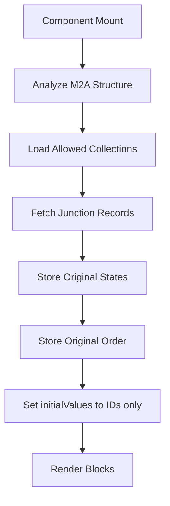
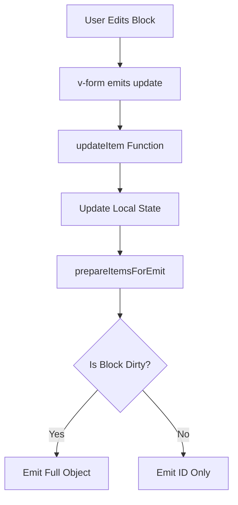
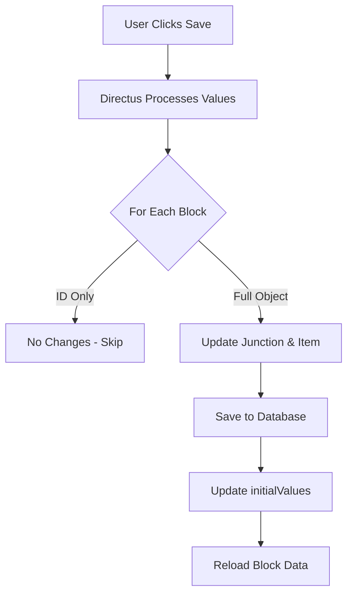
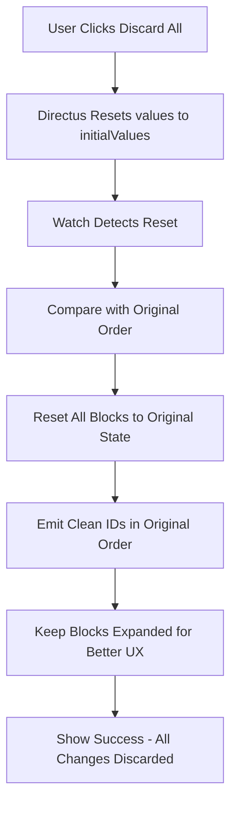

# Technical Architecture Documentation

## Overview

The Expandable Blocks extension is a Vue 3 interface component for Directus that solves the complex challenge of managing Many-to-Any (M2A) relationships with inline editing capabilities. This document details the technical implementation, design decisions, and architecture.

## Core Architecture

### Component Structure

```
expandable-blocks/
├── src/
│   ├── interface.vue          # Main interface component (editable)
│   ├── index.ts               # Interface configuration
│   ├── interface.css          # Styles
│   ├── directus-theme.css     # CSS variables documentation
│   ├── components/
│   │   └── NestedBlocks.vue   # Nested M2A display (readonly)
│   ├── utils/
│   │   ├── m2a-helper.ts      # M2A data handling
│   │   ├── helpers.ts         # Utility functions
│   │   └── logger.ts          # Debug logging
│   └── types/
│       ├── index.ts           # Core type definitions
│       └── directus.ts        # Directus-specific types
├── .vscode/                   # IDE support files
├── jsconfig.json             # JavaScript/Vue configuration
└── .stylelintrc.json         # CSS linting configuration
```

### Two-Component Architecture

The extension uses a **separation of concerns** approach with two distinct Vue components:

#### interface.vue (Main Component)
**Purpose**: Full CRUD operations for M2A blocks
- **Editable Interface**: Complete form editing with v-form integration
- **User Actions**: Add, edit, delete, duplicate, reorder blocks
- **State Management**: Handles dirty state, save/discard operations
- **Drag & Drop**: Implements sortable functionality
- **Permission Controls**: Respects user permissions and configuration
- **Complex Logic**: ~1400 lines handling all interface interactions

#### NestedBlocks.vue (Display Component)  
**Purpose**: Read-only display of nested M2A relationships
- **Readonly Display**: Shows nested content without editing capabilities
- **Recursive Rendering**: Can display deeply nested M2A structures
- **Compact UI**: Optimized for overview and navigation
- **Simple Logic**: ~130 lines focused on display and expansion
- **No State Conflicts**: Isolated from parent editing operations

#### Why This Separation?

1. **Complexity Management**: 
   - interface.vue handles complex editing logic
   - NestedBlocks.vue focuses solely on display

2. **Performance**: 
   - Lighter component for nested views
   - No drag&drop or editing overhead in nested display

3. **Recursion Safety**: 
   - NestedBlocks can safely call itself recursively
   - Avoids state conflicts between nested levels

4. **Use Case Clarity**:
   ```typescript
   // Main editing: interface.vue
   Page Content Blocks (editable)
   ├── Hero Block ← Full editing capabilities
   ├── Text Block ← Can add, edit, delete, reorder
   └── Gallery Block ← All CRUD operations
   
   // Nested display: NestedBlocks.vue  
   Gallery Block → Gallery Items (readonly)
   ├── Image 1 ← View only, no editing
   ├── Image 2 ← Shows content for context
   └── Image 3 ← Click to expand/collapse
   ```

### Key Technologies

- **Vue 3 Composition API**: For reactive state management
- **TypeScript**: Type safety and better IDE support
- **Directus Extensions SDK**: Integration with Directus
- **VueDraggable**: Drag-and-drop functionality

### TypeScript Architecture

The extension is built with **TypeScript Strict Mode** for maximum type safety:

#### Type System
```typescript
// Core interfaces
interface ExpandableBlocksOptions {
  enableSorting?: boolean;
  startExpanded?: boolean;
  accordionMode?: boolean;
  // ... all configuration options
}

interface JunctionRecord {
  id: string | number;
  collection: string;
  item: string | number | ItemRecord;
  sort?: number;
  [foreignKey: string]: any;
}

// Directus integration types
interface DirectusFormValues {
  [key: string]: any;
}
```

#### IDE Integration

**Vue Component Types** (`src/types/directus-components.d.ts`):
```typescript
declare module '@vue/runtime-core' {
  export interface GlobalComponents {
    VButton: DefineComponent<any, any, any>;
    VIcon: DefineComponent<any, any, any>;
    // ... all Directus components
  }
}
```

**CSS Custom Properties** (`.vscode/css-custom-data.json`):
- Autocomplete for all `--background-*`, `--primary-*` variables
- Hover documentation for CSS variables
- No "unknown property" warnings

**HTML Custom Data** (`.vscode/html-custom-data.json`):
- IntelliSense for `v-button`, `v-icon`, `v-menu` attributes
- Property validation and suggestions
- Component documentation on hover

## The M2A Challenge

### Problem Statement

Directus stores M2A relationships differently than it displays them:
- **Storage Format**: Array of junction IDs `[57, 58, 59]`
- **Display Format**: Array of objects with full data
```javascript
[
  { id: 57, collection: "content_text", item: { id: 1, title: "..." } },
  { id: 58, collection: "content_image", item: { id: 2, url: "..." } }
]
```

This mismatch causes issues with dirty state detection - Directus compares the stored IDs with the displayed objects, always seeing them as different.

### Solution: Selective Emitting with Order Preservation

The extension implements a sophisticated dirty tracking system:

```typescript
// Store original state when blocks load
const blockOriginalStates = ref<Map<string, any>>(new Map());

// Store original order for accurate comparison
const originalItemOrder = ref<(string | number)[]>([]);

// Check if individual block has changes
function isBlockDirty(blockId: string, currentItemData: any): boolean {
  const originalData = blockOriginalStates.value.get(blockId);
  if (!originalData) return true; // New blocks are always dirty
  return JSON.stringify(currentItemData) !== JSON.stringify(originalData);
}

// Emit IDs for clean blocks, full objects for dirty blocks
function prepareItemsForEmit(itemsArray: JunctionRecord[]): any[] {
  const result = itemsArray.map(item => {
    const blockId = item.id?.toString();
    const isDirty = isBlockDirty(blockId, item.item);
    return isDirty ? item : item.id;
  });
  
  // If all blocks are clean, preserve original order
  const dirtyCount = result.filter(item => typeof item === 'object').length;
  if (dirtyCount === 0 && originalItemOrder.value.length > 0) {
    const itemMap = new Map(itemsArray.map(item => [item.id, item]));
    return originalItemOrder.value.filter(id => itemMap.has(id));
  }
  
  return result;
}
```

## Data Flow

### 1. Initial Load



Key points:
- `initialValues` stores only IDs (Directus format)
- `blockOriginalStates` stores full item data for comparison
- `originalItemOrder` preserves the initial order
- No emit during initial load to prevent false dirty state

### 2. User Interaction



### 3. Save Process



### 4. Global Discard Process



**UX Enhancement**: Unlike standard interfaces, expanded blocks remain open after discard operations. This prevents the frustrating experience of having to re-expand blocks to see what was reverted, improving the user workflow significantly.

## State Management

### Reactive State

```typescript
// Core state
const items = ref<JunctionRecord[]>([]);              // Current blocks
const expandedItems = ref<string[]>([]);              // Expanded block IDs
const loading = ref<Record<string, boolean>>({});     // Loading states
const blockOriginalStates = ref<Map<string, any>>(new Map()); // Dirty tracking
const originalItemOrder = ref<(string | number)[]>([]); // Order preservation

// Flags
const isInitialLoad = ref(true);                      // Prevent initial emit
const isInternalUpdate = ref(false);                  // Prevent circular updates
const isFullyInitialized = ref(false);               // Initialization complete

// Injected from Directus
const values = inject('values', ref({}));             // Current form values
const initialValues = inject('initialValues', ref({})); // Original form values
```

### Watchers and State Synchronization

1. **Props Value Watcher**: Detects external changes (add/remove blocks)
2. **Values[field] Watcher**: Detects global discard events
3. **InitialValues Watcher**: Detects save events
4. **Order Preservation**: Maintains original order for accurate comparisons

## Advanced Features

### Permission Controls

```typescript
interface PermissionOptions {
  isAllowedDelete?: boolean;     // Can delete blocks
  isAllowedDuplicate?: boolean;  // Can duplicate blocks
  maxBlocks?: number | null;     // Maximum blocks allowed
}
```

The three-dot menu automatically hides when both delete and duplicate are disabled.

### Block-Level Actions

1. **Duplicate**: Creates a copy with "(Copy)" suffix
2. **Discard Changes**: Reverts individual block to saved state
3. **Delete**: Removes block with confirmation
4. **Status Change**: Quick status updates from header

### Global Integration

- **Save Button State**: Accurately reflects unsaved changes
- **Discard All Changes**: Resets all blocks while keeping them expanded
- **Form Validation**: Integrates with Directus validation

## UI/UX Design

### Professional Header Design

```vue
<div class="block-header">
  <!-- Drag Handle -->
  <v-icon name="drag_indicator" class="drag-handle" />
  
  <!-- Collection Icon with Dirty Indicator -->
  <div class="icon-wrapper">
    <v-icon :name="getCollectionIcon(item)" />
    <div v-if="isBlockDirty(...)" class="dirty-indicator" />
  </div>
  
  <!-- Main Info -->
  <div class="block-info">
    <span class="block-title">{{ title }}</span>
    <v-chip class="collection-chip">{{ collection }}</v-chip>
    <span v-if="showItemId" class="item-id">ID: {{ id }}</span>
  </div>
  
  <!-- Status Display -->
  <v-menu v-if="hasStatusField">
    <div class="status-display">
      <span class="status-dot" />
      <span class="status-text">{{ status }}</span>
    </div>
  </v-menu>
  
  <!-- Actions Menu -->
  <v-menu v-if="hasActions">
    <v-button icon="more_vert" />
  </v-menu>
</div>
```

### CSS Architecture

- Uses Directus CSS variables for consistency
- Smooth transitions and animations
- Responsive design
- Accessibility considerations

## Performance Optimizations

### 1. Lazy Loading
- Blocks load full data only when needed
- Loading states prevent UI flicker
- Efficient field selection in queries

### 2. Render Optimization
- Accordion mode limits rendered forms
- Compact mode reduces DOM elements
- Virtual scrolling ready (future enhancement)

### 3. Memory Management
- Clean up state for deleted blocks
- Remove from `blockOriginalStates` Map
- Clear loading states after operations

## API Integration

### M2A Helper Class

The `M2AHelper` class handles complex M2A data operations:

```typescript
class M2AHelper {
  // Analyze M2A field structure including nested relationships
  async analyzeM2AStructure(collection: string, field: string): Promise<M2AFieldInfo>

  // Load M2A data with proper field selection
  async loadM2AData(
    primaryKey: string | number, 
    fieldInfo: M2AFieldInfo, 
    currentDepth: number, 
    maxDepth: number
  ): Promise<any[]>

  // Get default data for new items
  getDefaultDataForCollection(collection: string): Record<string, any>
}
```

### Optimized Queries

```typescript
// Build efficient field selection
function buildM2AFieldsString(collections: CollectionInfo[]): string {
  const fields = ['*'];
  collections.forEach(col => {
    fields.push(`item:${col.collection}.*`);
  });
  return fields.join(',');
}
```

## Extension Configuration

### Interface Options

```typescript
interface ExpandableBlocksOptions {
  // Display Options
  enableSorting?: boolean;         // Drag-drop reordering
  startExpanded?: boolean;         // Auto-expand on load
  accordionMode?: boolean;         // One block at a time
  compactMode?: boolean;           // Condensed view
  showItemId?: boolean;            // Show item IDs
  
  // Permission Options
  isAllowedDelete?: boolean;       // Allow deletion
  isAllowedDuplicate?: boolean;    // Allow duplication
  maxBlocks?: number | null;       // Block limit
  
  // Advanced Options
  showFieldsFilter?: string[];     // Field whitelist
  allowedCollections?: string[];   // Override collections
}
```

### Field Configuration in index.ts

```typescript
options: [
  {
    field: 'enableSorting',
    name: 'Enable Sorting',
    type: 'boolean',
    meta: {
      interface: 'boolean',
      options: { label: 'Allow drag-and-drop reordering' },
      width: 'half',
      note: 'Enable drag-and-drop functionality to reorder blocks'
    },
    schema: { default_value: true }
  },
  // ... more options with descriptions
]
```

## Error Handling

### User-Friendly Notifications

```typescript
notificationsStore.add({
  title: 'Error Title',
  text: 'Descriptive message',
  type: 'error' | 'warning' | 'success'
});
```

### Error Recovery

1. **Network Failures**: Retry with exponential backoff
2. **Permission Errors**: Gracefully disable features
3. **Data Corruption**: Fallback to safe defaults
4. **State Inconsistency**: Reload from server

## Security Considerations

1. **Permissions**: All operations respect Directus permissions
2. **Validation**: Server-side validation enforced
3. **XSS Prevention**: No direct HTML rendering
4. **CSRF Protection**: Uses Directus authentication
5. **Input Sanitization**: Handled by Directus core

## Testing Strategy

### Unit Testing Considerations

```typescript
// Key functions to test
describe('ExpandableBlocks', () => {
  test('isBlockDirty detects changes', () => {
    // Test dirty state detection
  });
  
  test('prepareItemsForEmit handles mixed states', () => {
    // Test selective emitting
  });
  
  test('order preservation works correctly', () => {
    // Test original order maintenance
  });
});
```

### Integration Testing

1. Test with different collection types
2. Verify permission restrictions
3. Test state synchronization
4. Validate API interactions

## Debug Mode

Enable comprehensive logging:

```javascript
window.EXPANDABLE_BLOCKS_DEBUG = true
```

Logs include:
- Component lifecycle events
- State changes and emissions
- API calls and responses
- User interactions

## Future Enhancements

### Planned Features

1. **Bulk Operations**:
   - Select multiple blocks
   - Bulk delete/duplicate
   - Bulk status change

2. **Advanced Search**:
   - Filter blocks by content
   - Search across fields
   - Quick navigation

3. **Templates**:
   - Save block as template
   - Quick insert from templates
   - Share templates

4. **Performance**:
   - Virtual scrolling
   - Optimistic updates
   - Background auto-save

## Migration Guide

### From Standard M2A Interface

1. Change interface from `list-m2a` to `expandable-blocks`
2. Configure options as needed
3. No data migration required
4. All existing data preserved

### Version Compatibility

- Directus 10.x and 11.x supported
- Vue 3 required
- Modern browser with ES6 support

## Best Practices

### For Developers

1. **Use TypeScript**: Maintain type safety
2. **Follow Vue 3 patterns**: Composition API
3. **Test edge cases**: Empty states, permissions
4. **Document changes**: Update this architecture doc

### For Users

1. **Set appropriate limits**: Use `maxBlocks` wisely
2. **Configure permissions**: Restrict delete for critical content
3. **Use field filters**: Show only necessary fields
4. **Enable accordion mode**: For better performance with many blocks

## Conclusion

The Expandable Blocks extension demonstrates advanced Directus interface development, solving complex state management challenges while providing an intuitive user experience. The architecture prioritizes performance, maintainability, and extensibility, making it a robust solution for M2A relationship management.