# Technical Architecture Documentation

## 📚 Table of Contents

<table>
<tr>
<td width="33%">

### 🏗️ Core Concepts
- [📋 Overview](#overview)
- [🎯 Core Architecture](#core-architecture)
- [📁 Component Structure](#component-structure)
- [🔀 Two-Component Architecture](#two-component-architecture)
- [⚡ Key Technologies](#key-technologies)
- [📘 TypeScript Architecture](#typescript-architecture)
- [🎯 Native Directus Integration](#native-directus-integration)

</td>
<td width="33%">

### 🔄 Data Flow
- [🧩 The M2A Challenge](#the-m2a-challenge)
- [🌊 Data Flow & Lifecycle](#data-flow--lifecycle)
- [🏪 Store Architecture & Data](#store-architecture--data)
- [🔍 Dirty State Detection](#dirty-state-detection-flow)
- [💾 State Management](#state-management-details)
- [🚀 Advanced Features](#advanced-features)

</td>
<td width="33%">

### 🛠️ Development
- [🔌 API Integration](#api-integration)
- [⚙️ Extension Configuration](#extension-configuration)
- [❌ Error Handling](#error-handling)
- [🐛 Debugging & Troubleshooting](#debugging--troubleshooting)
- [🧪 Testing Strategy](#testing-strategy)
- [✅ Best Practices](#best-practices)

</td>
</tr>
</table>

---

## 📋 Overview

The Expandable Blocks extension is a Vue 3 interface component for Directus that solves the complex challenge of managing Many-to-Any (M2A) relationships with inline editing capabilities. This document details the technical implementation, design decisions, and architecture.

## 🎯 Core Architecture

### 📁 Component Structure

```
expandable-blocks/
├── src/
│   ├── interface.vue          # Main interface component (editable)
│   ├── index.ts               # Interface configuration
│   ├── interface.css          # Styles
│   ├── directus-theme.css     # CSS variables documentation
│   ├── components/
│   │   └── NestedBlocks.vue   # Nested M2A display (readonly)
│   ├── utils/
│   │   ├── m2a-helper.ts      # M2A data handling
│   │   ├── helpers.ts         # Utility functions
│   │   └── logger.ts          # Debug logging
│   └── types/
│       ├── index.ts           # Core type definitions
│       └── directus.ts        # Directus-specific types
├── .vscode/                   # IDE support files
├── jsconfig.json             # JavaScript/Vue configuration
└── .stylelintrc.json         # CSS linting configuration
```

### 🔀 Two-Component Architecture

The extension uses a **separation of concerns** approach with two distinct Vue components:

#### interface.vue (Main Component)
**Purpose**: Full CRUD operations for M2A blocks
- **Editable Interface**: Complete form editing with v-form integration
- **User Actions**: Add, edit, delete, duplicate, reorder blocks
- **State Management**: Handles dirty state, save/discard operations
- **Drag & Drop**: Implements sortable functionality
- **Permission Controls**: Respects user permissions and configuration
- **Complex Logic**: ~1400 lines handling all interface interactions

#### NestedBlocks.vue (Display Component)  
**Purpose**: Read-only display of nested M2A relationships
- **Readonly Display**: Shows nested content without editing capabilities
- **Recursive Rendering**: Can display deeply nested M2A structures
- **Compact UI**: Optimized for overview and navigation
- **Simple Logic**: ~130 lines focused on display and expansion
- **No State Conflicts**: Isolated from parent editing operations

#### Why This Separation?

1. **Complexity Management**: 
   - interface.vue handles complex editing logic
   - NestedBlocks.vue focuses solely on display

2. **Performance**: 
   - Lighter component for nested views
   - No drag&drop or editing overhead in nested display

3. **Recursion Safety**: 
   - NestedBlocks can safely call itself recursively
   - Avoids state conflicts between nested levels

4. **Use Case Clarity**:
   ```typescript
   // Main editing: interface.vue
   Page Content Blocks (editable)
   ├── Hero Block ← Full editing capabilities
   ├── Text Block ← Can add, edit, delete, reorder
   └── Gallery Block ← All CRUD operations
   
   // Nested display: NestedBlocks.vue  
   Gallery Block → Gallery Items (readonly)
   ├── Image 1 ← View only, no editing
   ├── Image 2 ← Shows content for context
   └── Image 3 ← Click to expand/collapse
   ```

### ⚡ Key Technologies

- **Vue 3 Composition API**: For reactive state management
- **TypeScript**: Type safety and better IDE support
- **Directus Extensions SDK**: Integration with Directus
- **VueDraggable**: Drag-and-drop functionality

### 📘 TypeScript Architecture

The extension is built with **TypeScript Strict Mode** for maximum type safety:

#### Type System
```typescript
// Core interfaces
interface ExpandableBlocksOptions {
  enableSorting?: boolean;
  startExpanded?: boolean;
  accordionMode?: boolean;
  // ... all configuration options
}

interface JunctionRecord {
  id: string | number;
  collection: string;
  item: string | number | ItemRecord;
  sort?: number;
  [foreignKey: string]: any;
}

// Directus integration types
interface DirectusFormValues {
  [key: string]: any;
}
```

#### IDE Integration

**Vue Component Types** (`src/types/directus-components.d.ts`):
```typescript
declare module '@vue/runtime-core' {
  export interface GlobalComponents {
    VButton: DefineComponent<any, any, any>;
    VIcon: DefineComponent<any, any, any>;
    // ... all Directus components
  }
}
```

**CSS Custom Properties** (`.vscode/css-custom-data.json`):
- Autocomplete for all `--background-*`, `--primary-*` variables
- Hover documentation for CSS variables
- No "unknown property" warnings

**HTML Custom Data** (`.vscode/html-custom-data.json`):
- IntelliSense for `v-button`, `v-icon`, `v-menu` attributes
- Property validation and suggestions
- Component documentation on hover

## 🎯 Native Directus Integration

### The Power of Native Save

One of the key architectural decisions of this extension is to **work entirely within Directus' native form system**. This provides several critical advantages:

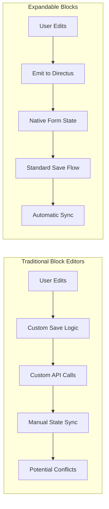

### Benefits of Native Integration

1. **No Custom API Calls**
   - All saves go through Directus' standard form submission
   - Respects field permissions automatically
   - Hooks and filters work as expected

2. **Save Options Work Perfectly**
   - "Save" - Works natively
   - "Save and Stay" - Maintains state correctly
   - "Save and Create New" - Functions as expected
   - "Save as Copy" - Duplicates blocks properly

3. **Global Actions Integrated**
   - "Discard Changes" reverts all blocks
   - Archive/Delete follows standard flow
   - Revision system tracks changes

4. **Proper Validation**
   - Required fields validated by Directus
   - Field permissions enforced
   - Custom validation rules applied

## 🧩 The M2A Challenge

### Problem Statement

Directus stores M2A relationships differently than it displays them:
- **Storage Format**: Array of junction IDs `[57, 58, 59]`
- **Display Format**: Array of objects with full data
```javascript
[
  { id: 57, collection: "content_text", item: { id: 1, title: "..." } },
  { id: 58, collection: "content_image", item: { id: 2, url: "..." } }
]
```

This mismatch causes issues with dirty state detection - Directus compares the stored IDs with the displayed objects, always seeing them as different.

### Solution: Selective Emitting with Order Preservation

The extension implements a sophisticated dirty tracking system that works seamlessly with Directus' native save mechanism:

#### How Native Integration Works

```typescript
// Instead of custom API calls:
// ❌ await api.post('/items/blocks', blockData)

// We emit to Directus form system:
// ✅ emit('input', mixedArray)

// Directus handles:
// - Validation
// - Permissions  
// - API calls
// - Error handling
// - Success feedback
```

#### Smart Dirty Tracking

```typescript
// Store original state when blocks load
const blockOriginalStates = ref<Map<string, any>>(new Map());

// Store original order for accurate comparison
const originalItemOrder = ref<(string | number)[]>([]);

// Check if individual block has changes
function isBlockDirty(blockId: string, currentItemData: any): boolean {
  const originalData = blockOriginalStates.value.get(blockId);
  if (!originalData) return true; // New blocks are always dirty
  return JSON.stringify(currentItemData) !== JSON.stringify(originalData);
}

// Emit IDs for clean blocks, full objects for dirty blocks
function prepareItemsForEmit(itemsArray: JunctionRecord[]): any[] {
  const result = itemsArray.map(item => {
    const blockId = item.id?.toString();
    const isDirty = isBlockDirty(blockId, item.item);
    return isDirty ? item : item.id;
  });
  
  // If all blocks are clean, preserve original order
  const dirtyCount = result.filter(item => typeof item === 'object').length;
  if (dirtyCount === 0 && originalItemOrder.value.length > 0) {
    const itemMap = new Map(itemsArray.map(item => [item.id, item]));
    return originalItemOrder.value.filter(id => itemMap.has(id));
  }
  
  return result;
}
```

## 🌊 Data Flow & Lifecycle

### 🔄 Component Lifecycle Overview

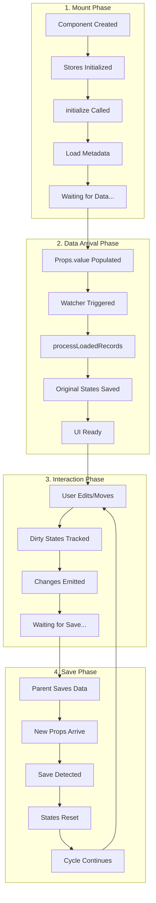

### 1️⃣ Initial Load Sequence

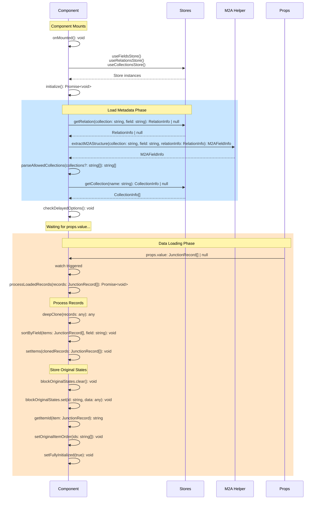

#### Key Data Types:

```typescript
interface JunctionRecord {
  id: string | number
  collection: string
  item: string | number | ItemRecord
  sort?: number
  [foreignKey: string]: any
}

interface M2AFieldInfo {
  collection: string
  field: string
  itemField: string
  junctionCollection: string
  junctionPrimaryKey: string
}

interface RelationInfo {
  collection: string
  field: string
  related_collection: string | null
  meta?: {
    sort_field?: string
    one_allowed_collections?: string[]
  }
}
```

### 2️⃣ User Edit Sequence

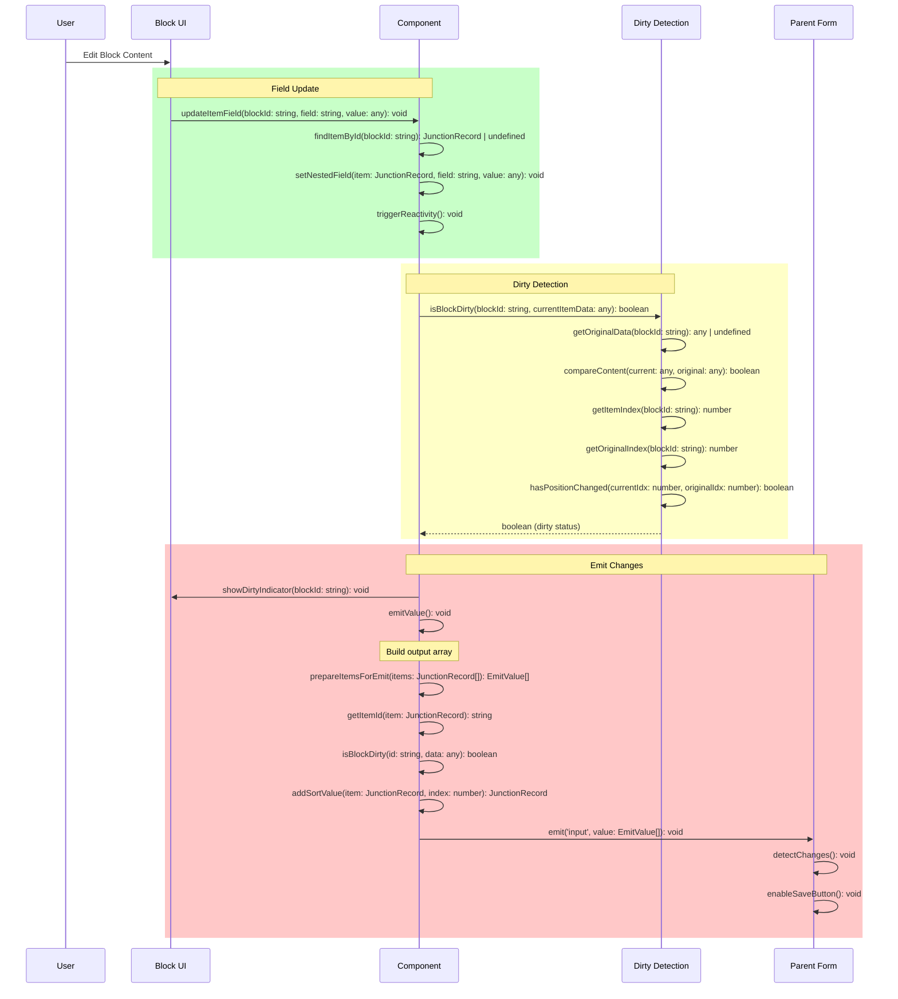

#### Method Signatures:

```typescript
// Update a field in a block
function updateItemField(
  blockId: string, 
  field: string, 
  value: any
): void

// Check if block has unsaved changes  
function isBlockDirty(
  blockId: string,
  currentItemData: any
): boolean

// Emit current state to parent
function emitValue(): void

// Helper to get block ID
function getItemId(
  item: JunctionRecord
): string
```

### 3️⃣ Drag & Drop Sequence

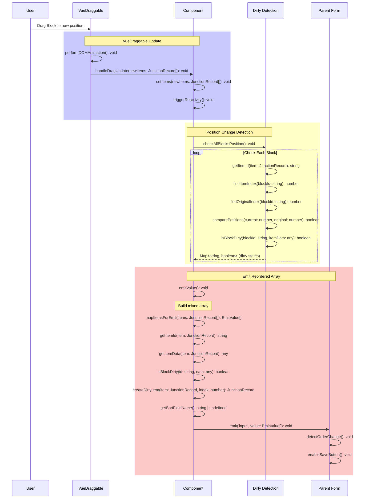

#### VueDraggable Configuration:

```typescript
// Template usage
<draggable
  v-model="items"
  :disabled="!sortable"
  :item-key="(item: JunctionRecord) => getItemId(item)"
  :animation="150"
  :force-fallback="true"
  handle=".drag-handle"
  @update:modelValue="handleDragUpdate"
>

// Drag update handler
function handleDragUpdate(newItems: JunctionRecord[]): void {
  items.value = newItems
  emitValue() // Triggers dirty detection for all blocks
}

// Type for mixed emit array
type MixedEmitArray = Array<JunctionRecord | string | number>
```

### 4️⃣ Save & Update Sequence

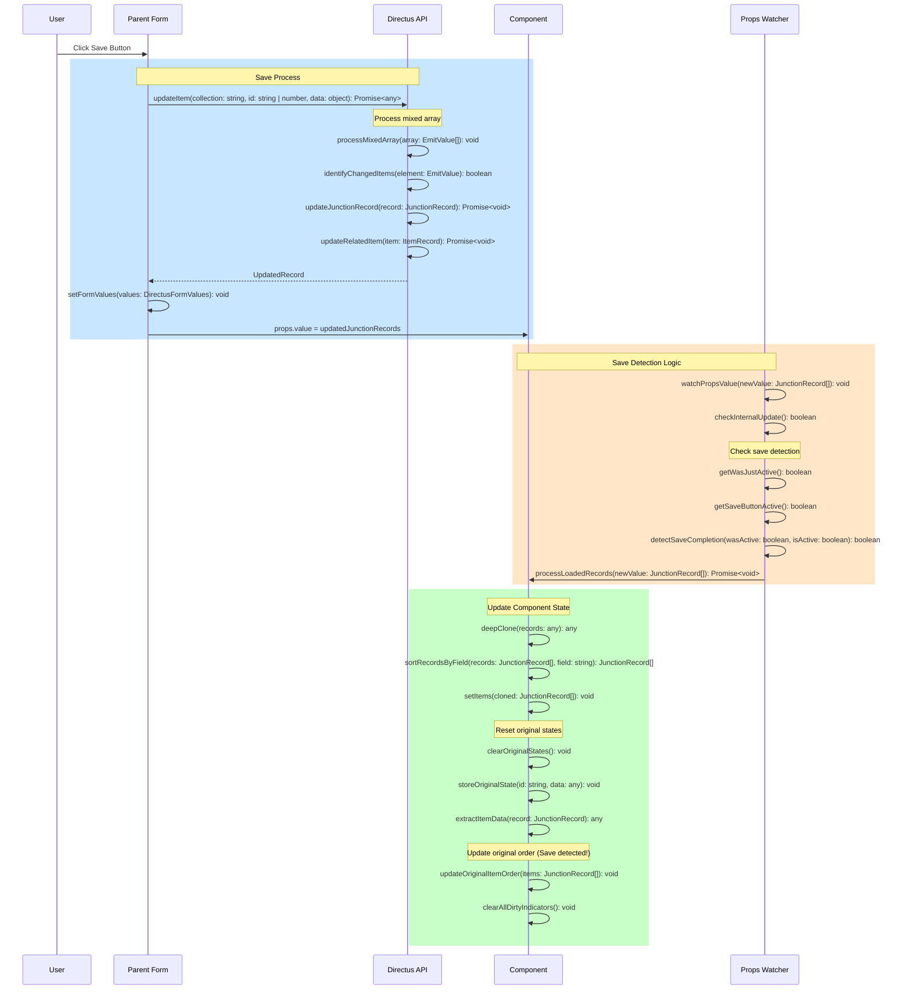

#### Save Detection Implementation:

```typescript
// Track save button state
const wasJustActive = ref(false)

watch(saveButtonWouldBeActive, (isActive) => {
  wasJustActive.value = isActive
})

// In props.value watcher
watch(() => props.value, async (newValue) => {
  if (isInternalUpdate.value) {
    isInternalUpdate.value = false
    return
  }
  
  await processLoadedRecords(newValue)
  
  // Critical: Detect save completion
  if (saveButtonWouldBeActive.value === false && wasJustActive.value) {
    // Save just completed - update original order!
    originalItemOrder.value = [...items.value.map(item => getItemId(item))]
    logger.log('💾 Save detected - original order updated')
  }
})

// Save button state computation
const saveButtonWouldBeActive = computed(() => {
  if (!values.value || !initialValues.value || !props.field) return false
  
  const currentValue = values.value[props.field]
  const initialValue = initialValues.value[props.field]
  
  return JSON.stringify(currentValue) !== JSON.stringify(initialValue)
})
```

### 5️⃣ Global Discard Sequence

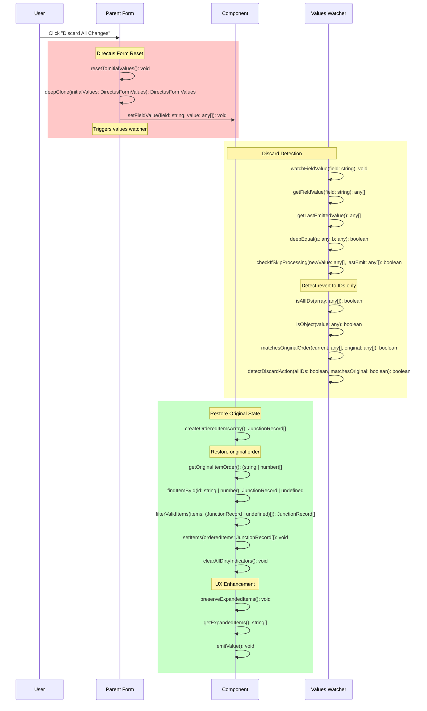

#### Discard Detection Implementation:

```typescript
// Track last emitted value
const lastEmittedValue = ref<any[]>([])

// Watch for global discard
watch(
  () => values.value?.[props.field],
  (newValue) => {
    if (!newValue || !isFullyInitialized.value) return
    
    // Skip if same as last emit
    if (deepEqual(newValue, lastEmittedValue.value)) return
    
    // Detect discard: all IDs matching original order
    const isAllIDs = newValue.every(v => 
      typeof v === 'string' || typeof v === 'number'
    )
    const matchesOriginal = deepEqual(newValue, originalItemOrder.value)
    
    if (isAllIDs && matchesOriginal && items.value.length > 0) {
      logger.log('🔄 Global discard detected')
      
      // Restore original order
      const orderedItems = originalItemOrder.value
        .map(id => items.value.find(item => 
          String(getItemId(item)) === String(id)
        ))
        .filter(Boolean) as JunctionRecord[]
      
      items.value = orderedItems
      emitValue() // Re-emit to sync
    }
  },
  { deep: true }
)

// Deep equality helper
function deepEqual(a: any, b: any): boolean {
  return JSON.stringify(a) === JSON.stringify(b)
}
```

**UX Enhancement**: Unlike standard interfaces, expanded blocks remain open after discard operations. This prevents the frustrating experience of having to re-expand blocks to see what was reverted, improving the user workflow significantly.

## Detailed Data Flow Implementation

### Core State Variables & Their Purpose

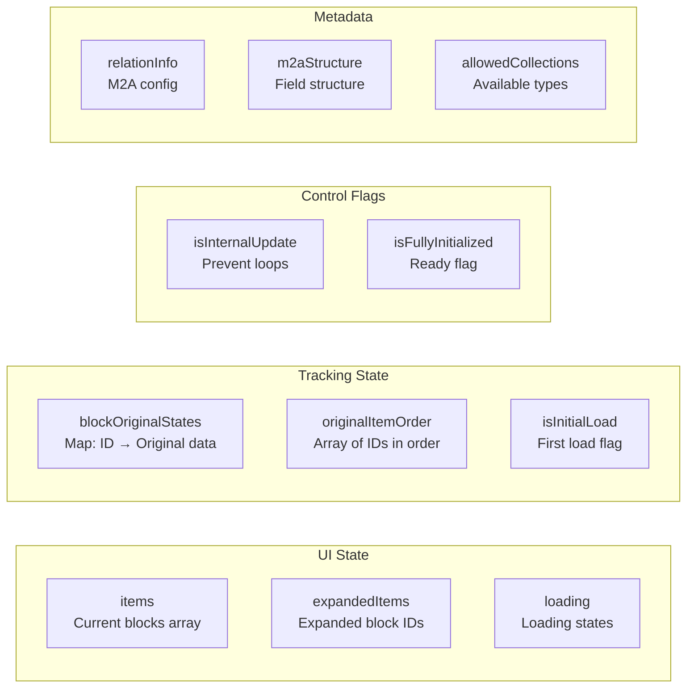

### Critical Timing: The Props.value Watcher

```typescript
watch(() => props.value, async (newValue) => {
  // 1. Skip if we caused this update
  if (isInternalUpdate.value) {
    isInternalUpdate.value = false
    return
  }
  
  // 2. Wait for collections to be ready
  if (allowedCollections.value.length === 0) {
    await nextTick()
    checkDelayedOptions()
  }
  
  // 3. Process the loaded records
  await processLoadedRecords(newValue)
  
  // 4. Mark as initialized
  isFullyInitialized.value = true
  
  // 5. Store original order for dirty detection
  originalItemOrder.value = items.value.map(item => getItemId(item))
  
  // 6. CRITICAL: Detect save completion
  if (saveButtonWouldBeActive.value === false && wasJustActive.value) {
    // Save just completed - update original order!
    originalItemOrder.value = [...items.value.map(item => getItemId(item))]
  }
}, { immediate: true, deep: true })
```

## 🏪 Store Architecture & Data

### Store Overview

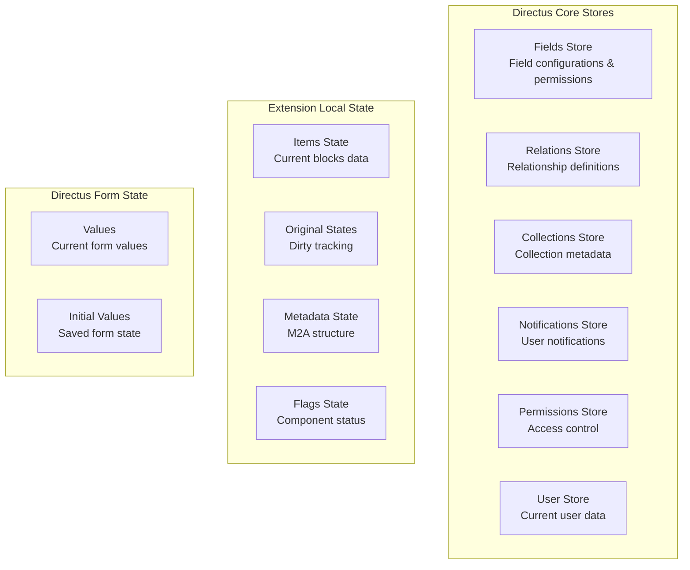

### 📦 Directus Core Stores

#### 1. Fields Store (`useFieldsStore`)

```typescript
interface DirectusFieldsStore {
  // Methods
  getFieldsForCollection(collection: string): Field[]
  getField(collection: string, field: string): Field | null
  getFieldsForCollections(collections: string[]): Field[]
  getPrimaryKeyFieldForCollection(collection: string): Field | null
  
  // Data Structure
  fields: Field[]
}

interface Field {
  collection: string
  field: string
  type: string // 'string', 'integer', 'datetime', etc.
  schema: {
    is_primary_key?: boolean
    is_nullable?: boolean
    default_value?: any
    max_length?: number
    numeric_precision?: number
    numeric_scale?: number
  }
  meta: {
    interface?: string // 'input', 'datetime', 'expandable-blocks', etc.
    display?: string
    display_options?: Record<string, any>
    readonly?: boolean
    hidden?: boolean
    width?: 'half' | 'full'
    translations?: Record<string, string>
    required?: boolean
    options?: Record<string, any>
    special?: string[] // ['m2a', 'file', 'cast-json', etc.]
  }
}

// Usage in Extension
const fieldsStore = useFieldsStore()
const fields = fieldsStore.getFieldsForCollection('content_blocks')
const primaryKey = fieldsStore.getPrimaryKeyFieldForCollection('pages')
```

#### 2. Relations Store (`useRelationsStore`)

```typescript
interface DirectusRelationsStore {
  // Methods
  getRelation(collection: string, field: string): RelationInfo | null
  getRelationsForCollection(collection: string): RelationInfo[]
  getRelationsForField(collection: string, field: string): RelationInfo[]
  
  // Data
  relations: RelationInfo[]
}

interface RelationInfo {
  id: number
  many_collection: string // Junction table
  many_field: string // Foreign key in junction
  one_collection: string | null // Can be null for M2A
  one_field: string | null
  one_collection_field?: string // For M2A
  one_allowed_collections?: string[] // For M2A
  junction_field?: string
  sort_field?: string // Important for ordering!
  one_deselect_action: 'nullify' | 'delete'
  
  meta?: {
    sort_field?: string // Sort field in junction table
    one_field?: string
    junction_field?: string
    one_allowed_collections?: string[]
    one_collection_field?: string
  }
}

// Usage Example
const relationsStore = useRelationsStore()
const relation = relationsStore.getRelation('pages', 'content_blocks')
// Returns: M2A relation info with junction table details
```

#### 3. Collections Store (`useCollectionsStore`)

```typescript
interface DirectusCollectionsStore {
  // Methods
  getCollection(name: string): Collection | null
  collections: Collection[]
  
  // Computed
  visibleCollections: Collection[]
  allCollections: Collection[]
}

interface Collection {
  collection: string
  meta: {
    collection: string
    icon?: string // 'box', 'article', 'image', etc.
    display_template?: string // "{{title}} - {{status}}"
    hidden?: boolean
    singleton?: boolean
    translations?: Record<string, string>
    archive_field?: string
    archive_value?: string
    unarchive_value?: string
    archive_app_filter?: boolean
    sort_field?: string
    group?: string
    collapse?: 'open' | 'closed' | 'locked'
    collection_divider?: boolean
    sort?: number
    accountability?: 'all' | 'activity' | null
    color?: string
    item_duplication_fields?: string[] | null
    note?: string
  }
  schema: {
    name: string
    comment?: string
  }
}

// Usage Example
const collectionsStore = useCollectionsStore()
const collection = collectionsStore.getCollection('content_hero')
const icon = collection?.meta?.icon || 'box'
const displayTemplate = collection?.meta?.display_template
```

#### 4. Notifications Store (`useNotificationsStore`)

```typescript
interface DirectusNotificationsStore {
  // Methods
  add(notification: NotificationOptions): string // Returns ID
  remove(id: string): void
  update(id: string, updates: Partial<NotificationOptions>): void
  
  // Data
  queue: Notification[]
}

interface NotificationOptions {
  title?: string
  text?: string
  type?: 'info' | 'success' | 'warning' | 'error'
  persist?: boolean
  closeable?: boolean
  duration?: number // milliseconds
  icon?: string
  loading?: boolean
  progress?: number // 0-100
  actions?: Array<{
    text: string
    action: () => void
    color?: string
  }>
}

// Usage Examples
const notificationsStore = useNotificationsStore()

// Success notification
notificationsStore.add({
  title: 'Success',
  text: 'Block saved successfully',
  type: 'success'
})

// Error with action
notificationsStore.add({
  title: 'Error Loading Block',
  text: 'Failed to load block data',
  type: 'error',
  persist: true,
  actions: [{
    text: 'Retry',
    action: () => loadFullItemData(blockId)
  }]
})
```

#### 5. Permissions Store (`usePermissionsStore`)

```typescript
interface DirectusPermissionsStore {
  // Methods
  hasPermission(collection: string, action: string): boolean
  getFieldPermissions(collection: string): FieldPermissions
  
  // Data
  permissions: Permission[]
}

interface Permission {
  id: number
  role: string
  collection: string
  action: 'create' | 'read' | 'update' | 'delete'
  permissions: Record<string, any> | null
  validation: Record<string, any> | null
  presets: Record<string, any> | null
  fields: string[] | null
}

// Usage
const permissionsStore = usePermissionsStore()
const canDelete = permissionsStore.hasPermission('content_blocks', 'delete')
const canUpdate = permissionsStore.hasPermission('content_blocks', 'update')
```

#### 6. User Store (`useUserStore`)

```typescript
interface DirectusUserStore {
  // Current user data
  currentUser: User | null
  loading: boolean
  error: any | null
  
  // Methods
  hydrate(): Promise<void>
  dehydrate(): void
}

interface User {
  id: string
  first_name: string
  last_name: string
  email: string
  avatar: string | null
  language: string
  theme: 'light' | 'dark' | 'auto'
  role: {
    id: string
    name: string
    admin_access: boolean
    app_access: boolean
  }
}

// Usage
const userStore = useUserStore()
const isAdmin = userStore.currentUser?.role?.admin_access || false
```

### 📋 Extension Local State

```typescript
// Component State Management
const componentState = {
  // Current block items
  items: ref<JunctionRecord[]>([]),
  
  // Tracks which blocks are expanded
  expandedItems: ref<string[]>([]),
  
  // Loading states per block
  loading: ref<Record<string, boolean>>({}),
  
  // Original state for dirty detection
  blockOriginalStates: ref<Map<string, any>>(new Map()),
  
  // Original order for position tracking
  originalItemOrder: ref<(string | number)[]>([]),
  
  // Last emitted value for comparison
  lastEmittedValue: ref<any[]>([]),
  
  // Control flags
  isInitialLoad: ref(true),
  isInternalUpdate: ref(false),
  isFullyInitialized: ref(false),
  
  // Metadata
  relationInfo: ref<RelationInfo | null>(null),
  m2aStructure: ref<M2AFieldInfo | null>(null),
  allowedCollections: ref<CollectionInfo[]>([])
}
```

### 💉 Injected Form State

```typescript
// Injected from parent Directus form
const values = inject('values', ref({})) as Ref<DirectusFormValues>
const initialValues = inject('initialValues', ref({})) as Ref<DirectusFormValues>

// Structure
interface DirectusFormValues {
  // Dynamic based on collection
  [field: string]: any
  
  // For pages collection example:
  id?: number
  title?: string
  content_blocks?: (JunctionRecord | string | number)[] // Our M2A field
  status?: 'published' | 'draft' | 'archived'
  date_created?: string
  date_updated?: string
}

// Access current value
const currentBlocks = values.value[props.field] // e.g., values.value['content_blocks']

// Access saved value
const savedBlocks = initialValues.value[props.field]

// Detect changes
const hasChanges = JSON.stringify(currentBlocks) !== JSON.stringify(savedBlocks)
```

### 🔄 Store Interaction Flow

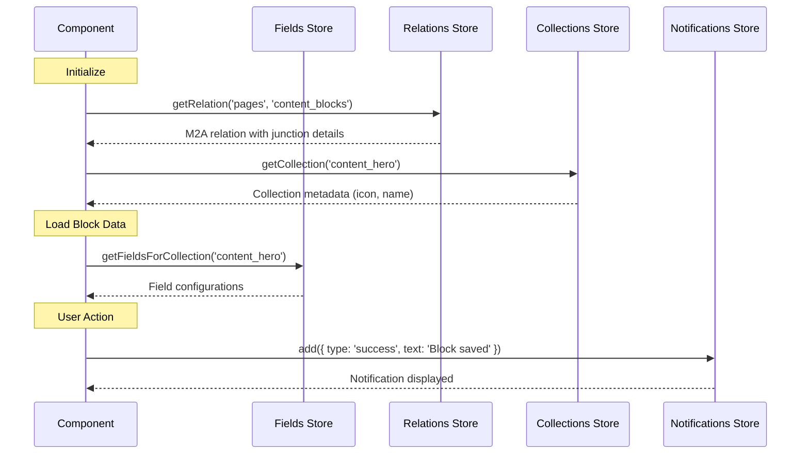

### 🔍 Dirty State Detection Flow

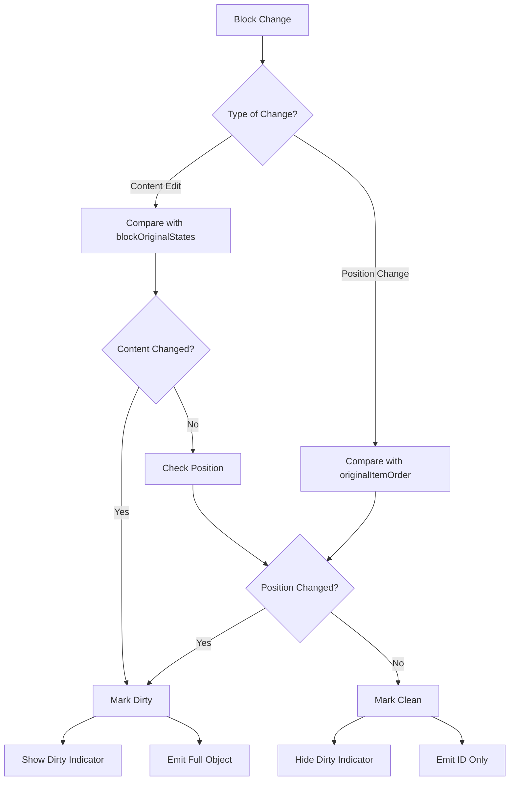

## 💾 State Management Details

### 📋 Reactive State Variables

```typescript
// Core state
const items = ref<JunctionRecord[]>([]);              // Current blocks
const expandedItems = ref<string[]>([]);              // Expanded block IDs
const loading = ref<Record<string, boolean>>({});     // Loading states
const blockOriginalStates = ref<Map<string, any>>(new Map()); // Dirty tracking
const originalItemOrder = ref<(string | number)[]>([]); // Order preservation

// Flags
const isInitialLoad = ref(true);                      // Prevent initial emit
const isInternalUpdate = ref(false);                  // Prevent circular updates
const isFullyInitialized = ref(false);               // Initialization complete

// Injected from Directus
const values = inject('values', ref({}));             // Current form values
const initialValues = inject('initialValues', ref({})); // Original form values
```

### 👀 Critical Watchers

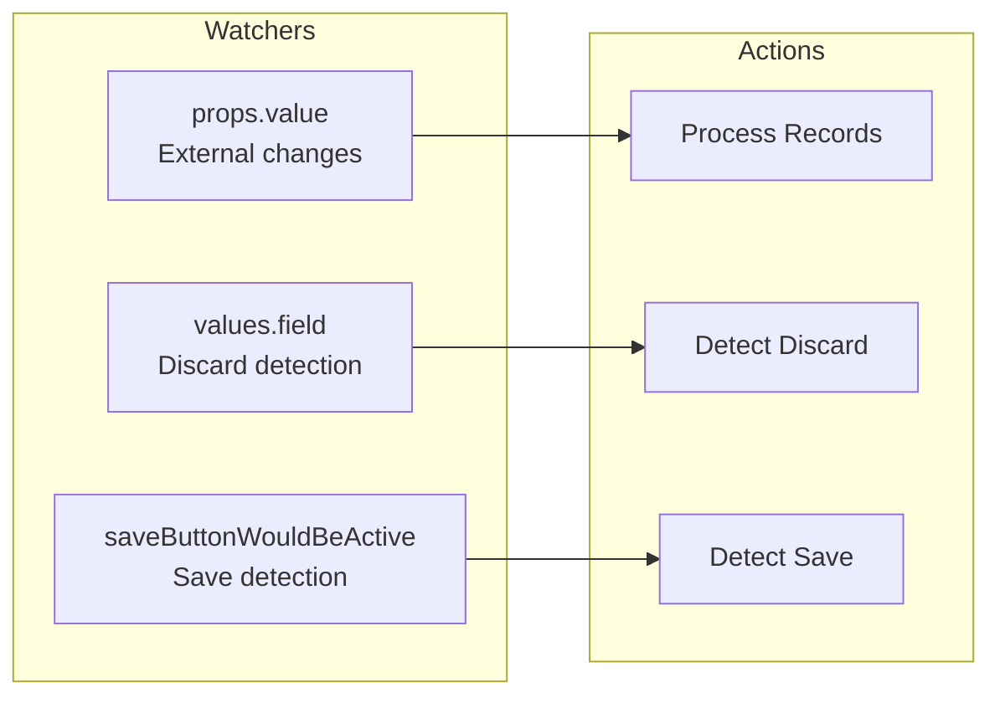

## 🚀 Advanced Features

### Permission Controls

```typescript
interface PermissionOptions {
  isAllowedDelete?: boolean;     // Can delete blocks
  isAllowedDuplicate?: boolean;  // Can duplicate blocks
  maxBlocks?: number | null;     // Maximum blocks allowed
}
```

The three-dot menu automatically hides when both delete and duplicate are disabled.

### Block-Level Actions

1. **Duplicate**: Creates a copy with "(Copy)" suffix
2. **Discard Changes**: Reverts individual block to saved state
3. **Delete**: Removes block with confirmation
4. **Status Change**: Quick status updates from header

### Global Integration

- **Save Button State**: Accurately reflects unsaved changes
- **Discard All Changes**: Resets all blocks while keeping them expanded
- **Form Validation**: Integrates with Directus validation

## UI/UX Design

### Professional Header Design

```vue
<div class="block-header">
  <!-- Drag Handle -->
  <v-icon name="drag_indicator" class="drag-handle" />
  
  <!-- Collection Icon with Dirty Indicator -->
  <div class="icon-wrapper">
    <v-icon :name="getCollectionIcon(item)" />
    <div v-if="isBlockDirty(...)" class="dirty-indicator" />
  </div>
  
  <!-- Main Info -->
  <div class="block-info">
    <span class="block-title">{{ title }}</span>
    <v-chip class="collection-chip">{{ collection }}</v-chip>
    <span v-if="showItemId" class="item-id">ID: {{ id }}</span>
  </div>
  
  <!-- Status Display -->
  <v-menu v-if="hasStatusField">
    <div class="status-display">
      <span class="status-dot" />
      <span class="status-text">{{ status }}</span>
    </div>
  </v-menu>
  
  <!-- Actions Menu -->
  <v-menu v-if="hasActions">
    <v-button icon="more_vert" />
  </v-menu>
</div>
```

### CSS Architecture

- Uses Directus CSS variables for consistency
- Smooth transitions and animations
- Responsive design
- Accessibility considerations

## Performance Optimizations

### 1. Lazy Loading
- Blocks load full data only when needed
- Loading states prevent UI flicker
- Efficient field selection in queries

### 2. Render Optimization
- Accordion mode limits rendered forms
- Compact mode reduces DOM elements
- Virtual scrolling ready (future enhancement)

### 3. Memory Management
- Clean up state for deleted blocks
- Remove from `blockOriginalStates` Map
- Clear loading states after operations

## 🔌 API Integration

### M2A Helper Class

The `M2AHelper` class handles complex M2A data operations:

```typescript
class M2AHelper {
  // Analyze M2A field structure including nested relationships
  async analyzeM2AStructure(collection: string, field: string): Promise<M2AFieldInfo>

  // Load M2A data with proper field selection
  async loadM2AData(
    primaryKey: string | number, 
    fieldInfo: M2AFieldInfo, 
    currentDepth: number, 
    maxDepth: number
  ): Promise<any[]>

  // Get default data for new items
  getDefaultDataForCollection(collection: string): Record<string, any>
}
```

### Optimized Queries

```typescript
// Build efficient field selection
function buildM2AFieldsString(collections: CollectionInfo[]): string {
  const fields = ['*'];
  collections.forEach(col => {
    fields.push(`item:${col.collection}.*`);
  });
  return fields.join(',');
}
```

## ⚙️ Extension Configuration

### Interface Options

```typescript
interface ExpandableBlocksOptions {
  // Display Options
  enableSorting?: boolean;         // Drag-drop reordering
  startExpanded?: boolean;         // Auto-expand on load
  accordionMode?: boolean;         // One block at a time
  compactMode?: boolean;           // Condensed view
  showItemId?: boolean;            // Show item IDs
  
  // Permission Options
  isAllowedDelete?: boolean;       // Allow deletion
  isAllowedDuplicate?: boolean;    // Allow duplication
  maxBlocks?: number | null;       // Block limit
  
  // Advanced Options
  showFieldsFilter?: string[];     // Field whitelist
  allowedCollections?: string[];   // Override collections
}
```

### Field Configuration in index.ts

```typescript
options: [
  {
    field: 'enableSorting',
    name: 'Enable Sorting',
    type: 'boolean',
    meta: {
      interface: 'boolean',
      options: { label: 'Allow drag-and-drop reordering' },
      width: 'half',
      note: 'Enable drag-and-drop functionality to reorder blocks'
    },
    schema: { default_value: true }
  },
  // ... more options with descriptions
]
```

## ❌ Error Handling

### User-Friendly Notifications

```typescript
notificationsStore.add({
  title: 'Error Title',
  text: 'Descriptive message',
  type: 'error' | 'warning' | 'success'
});
```

### Error Recovery

1. **Network Failures**: Retry with exponential backoff
2. **Permission Errors**: Gracefully disable features
3. **Data Corruption**: Fallback to safe defaults
4. **State Inconsistency**: Reload from server

## Security Considerations

1. **Permissions**: All operations respect Directus permissions
2. **Validation**: Server-side validation enforced
3. **XSS Prevention**: No direct HTML rendering
4. **CSRF Protection**: Uses Directus authentication
5. **Input Sanitization**: Handled by Directus core

## 🧪 Testing Strategy

### Unit Testing Considerations

```typescript
// Key functions to test
describe('ExpandableBlocks', () => {
  test('isBlockDirty detects changes', () => {
    // Test dirty state detection
  });
  
  test('prepareItemsForEmit handles mixed states', () => {
    // Test selective emitting
  });
  
  test('order preservation works correctly', () => {
    // Test original order maintenance
  });
});
```

### Integration Testing

1. Test with different collection types
2. Verify permission restrictions
3. Test state synchronization
4. Validate API interactions

## Debug Mode

Enable comprehensive logging:

```javascript
window.EXPANDABLE_BLOCKS_DEBUG = true
```

Logs include:
- Component lifecycle events
- State changes and emissions
- API calls and responses
- User interactions

## Future Enhancements

### Planned Features

1. **Bulk Operations**:
   - Select multiple blocks
   - Bulk delete/duplicate
   - Bulk status change

2. **Advanced Search**:
   - Filter blocks by content
   - Search across fields
   - Quick navigation

3. **Templates**:
   - Save block as template
   - Quick insert from templates
   - Share templates

4. **Performance**:
   - Virtual scrolling
   - Optimistic updates
   - Background auto-save

## Migration Guide

### From Standard M2A Interface

1. Change interface from `list-m2a` to `expandable-blocks`
2. Configure options as needed
3. No data migration required
4. All existing data preserved

### Version Compatibility

- Directus 10.x and 11.x supported
- Vue 3 required
- Modern browser with ES6 support

## 🐛 Debugging & Troubleshooting

### 🎯 Key Debug Points

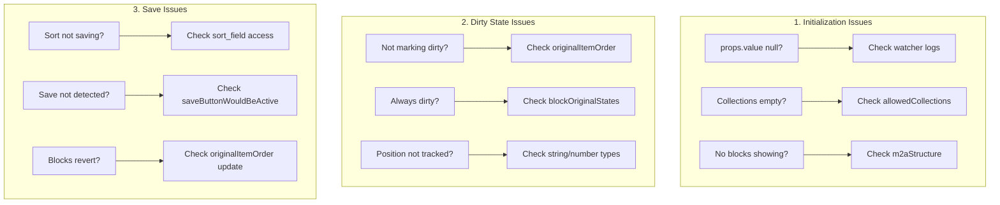

### 🔧 Debug Helper Functions

```typescript
// Add to component for debugging
const debugState = computed(() => ({
  itemCount: items.value.length,
  dirtyBlocks: items.value.filter((item, idx) => {
    const id = getItemId(item)
    const data = item[m2aStructure.value?.itemField || '']
    return isBlockDirty(id, data)
  }).map(item => getItemId(item)),
  originalOrder: originalItemOrder.value,
  currentOrder: items.value.map(item => getItemId(item)),
  sortField: relationInfo.value?.meta?.sort_field,
  isFullyInitialized: isFullyInitialized.value
}))

// Track specific block
function debugBlock(blockId: string) {
  const item = items.value.find(i => getItemId(i) === blockId)
  console.log('Block Debug:', {
    id: blockId,
    currentIndex: items.value.findIndex(i => getItemId(i) === blockId),
    originalIndex: originalItemOrder.value.indexOf(blockId),
    isDirty: isBlockDirty(blockId, item?.[m2aStructure.value?.itemField || '']),
    originalState: blockOriginalStates.value.get(blockId),
    currentState: item?.[m2aStructure.value?.itemField || '']
  })
}
```

### 💡 Common Issues & Solutions

| Issue | Cause | Solution |
|-------|-------|----------|
| Blocks not loading | `props.value` is null on mount | Use immediate watcher |
| Sort not persisting | Wrong sort field path | Use `relationInfo.value?.meta?.sort_field` |
| Blocks jump after save | `originalItemOrder` not updated | Detect save and update order |
| Always marked dirty | Reference equality issues | Use `deepClone()` for states |
| Permission errors | Can't access junction fields | Use position-based tracking |

### ⏰ Critical Timing Issues

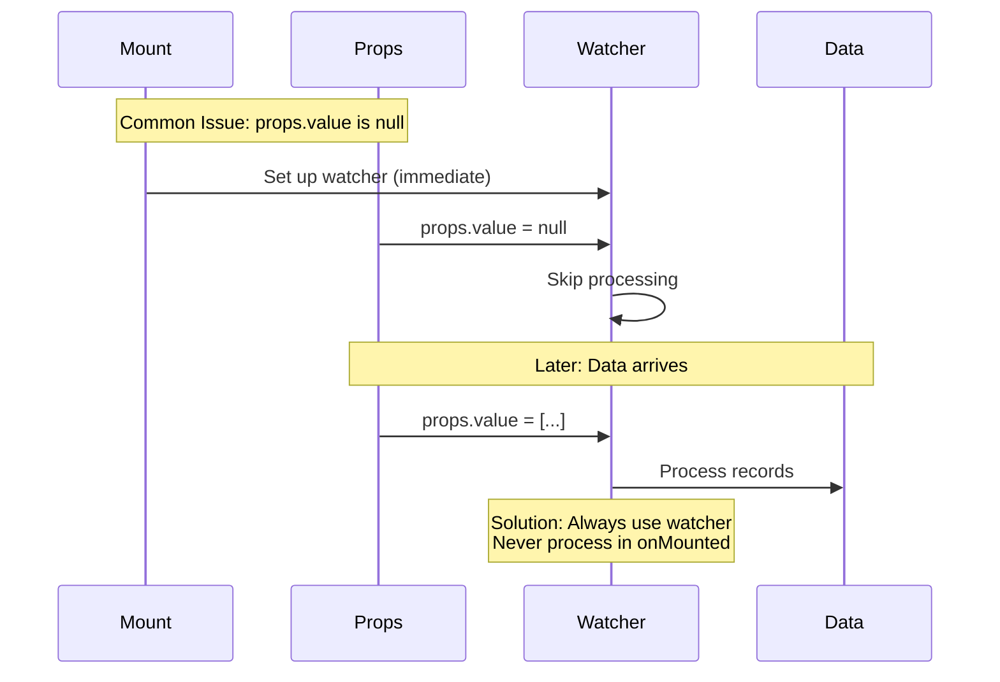

## ✅ Best Practices

### For Developers

1. **Always Deep Clone**: Use `deepClone()` when storing states
2. **Type Consistency**: Handle string/number ID conversions
3. **Use Watchers**: Never process data in `onMounted()`
4. **Flag Management**: Reset flags appropriately
5. **Test Edge Cases**: Empty states, permissions, timing
6. **Document Changes**: Update this architecture doc

### For Users

1. **Set appropriate limits**: Use `maxBlocks` wisely
2. **Configure permissions**: Restrict delete for critical content
3. **Use field filters**: Show only necessary fields
4. **Enable accordion mode**: For better performance with many blocks
5. **Monitor performance**: Use debug mode for issues

## 📊 Complete Type Definitions

### Core Interfaces

```typescript
// Main component props
interface UseExpandableBlocksProps {
  value: JunctionRecord[] | null
  collection: string
  field: string
  primaryKey?: string | number
  disabled?: boolean
  options?: ExpandableBlocksOptions
}

// Junction record structure
interface JunctionRecord {
  id: string | number
  collection: string
  item: string | number | ItemRecord
  sort?: number
  [foreignKey: string]: any // Additional foreign keys
}

// Item data structure
interface ItemRecord {
  id: string | number
  [field: string]: any // Dynamic fields based on collection
}

// M2A field metadata
interface M2AFieldInfo {
  collection: string
  field: string
  itemField: string
  junctionCollection: string
  junctionPrimaryKey: string
}

// Relation metadata from Directus
interface RelationInfo {
  collection: string
  field: string
  related_collection: string | null
  meta?: {
    sort_field?: string
    one_allowed_collections?: string[]
    one_field?: string
    junction_field?: string
  }
}

// Collection metadata
interface CollectionInfo {
  collection: string
  name: string
  icon: string
  meta?: {
    display_template?: string
    singleton?: boolean
  }
}

// Component options
interface ExpandableBlocksOptions {
  // Display
  enableSorting?: boolean
  startExpanded?: boolean
  accordionMode?: boolean
  compactMode?: boolean
  showItemId?: boolean
  
  // Permissions
  isAllowedDelete?: boolean
  isAllowedDuplicate?: boolean
  maxBlocks?: number | null
  
  // Advanced
  showFieldsFilter?: string[]
  allowedCollections?: string[]
}

// Directus store types
interface DirectusFormValues {
  [field: string]: any
}

interface DirectusFieldsStore {
  getFieldsForCollection(collection: string): Field[]
  getField(collection: string, field: string): Field | null
}

interface DirectusRelationsStore {
  getRelation(collection: string, field: string): RelationInfo | null
  getRelationsForCollection(collection: string): RelationInfo[]
}

interface DirectusCollectionsStore {
  getCollection(name: string): CollectionInfo | null
  collections: CollectionInfo[]
}
```

### State Management Types

```typescript
// Component state
interface ComponentState {
  // Core data
  items: Ref<JunctionRecord[]>
  expandedItems: Ref<string[]>
  loading: Ref<Record<string, boolean>>
  
  // Tracking
  blockOriginalStates: Ref<Map<string, any>>
  originalItemOrder: Ref<(string | number)[]>
  lastEmittedValue: Ref<any[]>
  
  // Flags
  isInitialLoad: Ref<boolean>
  isInternalUpdate: Ref<boolean>
  isFullyInitialized: Ref<boolean>
  
  // Metadata
  relationInfo: Ref<RelationInfo | null>
  m2aStructure: Ref<M2AFieldInfo | null>
  allowedCollections: Ref<CollectionInfo[]>
}

// Emit types
type EmitValue = (JunctionRecord | string | number)[]
type EmitFunction = (event: 'input', value: EmitValue) => void
```

## 🎯 Conclusion

The Expandable Blocks extension demonstrates advanced Directus interface development, solving complex state management challenges while providing an intuitive user experience. The architecture prioritizes performance, maintainability, and extensibility, making it a robust solution for M2A relationship management.

### Key Architectural Insights:

1. **Data Flow Mastery**
   - Data loading happens in watchers, not on mount
   - Props.value timing is critical for initialization
   - Multiple watchers coordinate state synchronization

2. **Dirty State Innovation**
   - Tracks both content AND position changes
   - Uses original state snapshots for accurate comparison
   - Selective emitting reduces unnecessary updates

3. **Save/Discard Detection**
   - Complex save detection through button state tracking
   - Discard detection via deep value comparison
   - Original order preservation for accurate restoration

4. **UX Enhancements**
   - Blocks remain expanded during discard operations
   - Visual dirty indicators provide immediate feedback
   - Smooth animations enhance user experience

Understanding this data flow is crucial for development and debugging. The detailed sequence diagrams, method signatures, and type definitions provide a complete reference for maintaining and extending the extension.