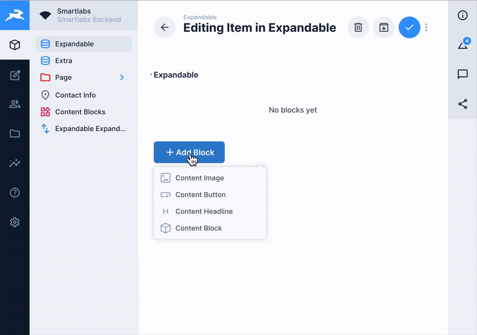

# Directus Expandable Blocks Interface

[](https://www.npmjs.com/package/directus-extension-expandable-blocks)
[](https://www.npmjs.com/package/directus-extension-expandable-blocks)
[](https://github.com/smartlabsAT/directus-expandable-blocks/releases)
[](https://github.com/smartlabsAT/directus-expandable-blocks/blob/master/LICENSE)
[](https://directus.io)

A powerful M2A (Many-to-Any) interface for Directus with inline expandable editing that seamlessly integrates with Directus' native save system.

[📚 Documentation](https://github.com/smartlabsAT/directus-expandable-blocks/wiki) • 
[🐛 Report Bug](https://github.com/smartlabsAT/directus-expandable-blocks/issues/new?template=bug_report.md) • 
[✨ Request Feature](https://github.com/smartlabsAT/directus-expandable-blocks/issues/new?template=feature_request.md) • 
[📦 NPM Package](https://www.npmjs.com/package/directus-extension-expandable-blocks)



## 📖 Table of Contents

- [Documentation](#-documentation)
- [Why Expandable Blocks?](#-why-expandable-blocks)
- [Features](#-features)
- [Installation](#-installation)
- [Usage](#-usage)
- [Configuration Options](#️-configuration-options)
- [Testing](#-testing)
- [Development](#-development)
- [Contributing](#-contributing)
- [License](#-license)
- [Support](#-issues--support)
- [Changelog](#-changelog)
- [Roadmap](#️-roadmap)

## 📚 Documentation

For comprehensive documentation, visit our **[GitHub Wiki](https://github.com/smartlabsAT/directus-expandable-blocks/wiki)** which includes:
- Detailed installation guide
- Configuration options
- Architecture overview
- API integration guide
- Development & debugging
- Security best practices
- Migration guide
- And much more!

## 🎯 Why Expandable Blocks?

Unlike other block editors, this extension **works directly with Directus' native form system**:
- ✅ **No custom API calls** - Uses Directus' built-in save/revert functionality
- ✅ **Native Save & Stay** - Works perfectly with Directus' save options
- ✅ **Global Discard** - Integrates with Directus' "Discard Changes" button
- ✅ **Proper Dirty State** - Save button only appears when changes exist
- ✅ **No Data Loss** - All changes tracked through Directus' form state

This means you get all the benefits of a sophisticated block editor while maintaining full compatibility with Directus' workflow!

## ✨ Features

### Core Interface
- **Inline Expandable Editing**: Edit block content directly without opening separate forms
- **Drag & Drop Sorting**: Reorder blocks with intuitive drag-and-drop
- **Native Integration**: Uses Directus' save system - no custom API calls
- **Smart Dirty State**: Only sends changed blocks to the server
- **Status Management**: Quick status changes with visual indicators
- **Visual Feedback**: See which blocks have unsaved changes
- **Compact & Full View Modes**: Adaptive display options
- **Keyboard Navigation**: Full keyboard support

### Advanced Functionality
- **Nested M2A Support**: Handle complex nested relationships
- **Custom Field Filtering**: Show only specific fields in edit mode
- **Template System**: Pre-configured content templates
- **Status Management**: Built-in content status workflows

### Configuration Options
- Enable/disable sorting
- Show/hide item IDs
- Accordion mode (one block expanded at a time)
- Compact display mode
- Maximum block limits
- Custom field filtering

## 📦 Installation

### Via NPM (Recommended)

Install directly from the npm registry:

```bash
npm install directus-extension-expandable-blocks
```

The extension will be automatically loaded by Directus when you restart your instance.

### Manual Installation

1. Download the latest release from [GitHub Releases](https://github.com/smartlabsAT/directus-expandable-blocks/releases)
2. Extract to your Directus `extensions/interfaces/` directory
3. Restart Directus

### Docker Installation

For Docker setups, install via npm in your Dockerfile or mount the extension directory:

```dockerfile
RUN npm install directus-extension-expandable-blocks
# or mount volume: -v ./extensions:/directus/extensions
```

## 🚀 Usage

### Basic Setup

#### 1️⃣ Create an M2A (Many-to-Any) Field

1. Navigate to **Settings → Data Model → [Your Collection]**
2. Click **"Create Field"** button
3. Choose **"Many to Any Relationship (M2A)"** field type
4. Configure the relationship:
   - **Field Key**: e.g., `content_blocks`
   - **Related Collections**: Select which collections can be used as blocks

#### 2️⃣ Select the Expandable Blocks Interface

1. In the field configuration, go to the **"Interface"** tab
2. Click on the interface dropdown (default is "Many to Any")
3. **Select "Expandable Blocks"** from the list
4. The interface will change to show expandable blocks options

#### 3️⃣ Configure Interface Options

In the interface configuration panel, you can set:

- **Display Options**
  - ✅ Enable Sorting - Allow drag & drop reordering
  - 📂 Start Expanded - Blocks open by default
  - 🎯 Accordion Mode - Only one block open at a time
  - 📱 Compact Mode - Condensed view for many blocks
  
- **Permissions**
  - 🗑️ Allow Delete - Users can remove blocks
  - 📋 Allow Duplicate - Users can copy blocks
  - 🔢 Max Blocks - Limit number of blocks (empty = unlimited)

#### 4️⃣ Save and Use

1. Click **"Save"** to apply the configuration
2. Navigate to your collection items
3. The M2A field will now use the Expandable Blocks interface!

### Example M2A Structure

```yaml
# Main Collection (e.g., "pages")
Page Collection:
  - id: primary key
  - title: string
  - slug: string
  - content_blocks: M2A field → Uses "Expandable Blocks" interface
  - status: string
  - date_created: timestamp

# Junction Collection (auto-created by Directus)
pages_blocks:
  - id: primary key
  - pages_id: foreign key → pages.id
  - collection: string (which block type)
  - item: foreign key → block item id
  - sort: integer (for ordering)

# Block Collections (your content types)
content_text:
  - id: primary key
  - headline: string
  - subheadline: string
  - content: text (rich text editor)
  - alignment: string

content_hero:
  - id: primary key
  - headline: string
  - subheadline: string
  - button_text: string
  - button_link: string
  - image: file (image)
  - overlay: boolean

content_gallery:
  - id: primary key
  - title: string
  - images: O2M → gallery_images
  - columns: integer
  - spacing: string
```

### Visual Guide

<details>
<summary>📸 Click to see setup screenshots</summary>

1. **Creating M2A Field**
   - Select M2A relationship type
   - Configure related collections

2. **Selecting Interface**
   - Change from default "Many to Any" 
   - Select "Expandable Blocks"

3. **Interface in Action**
   - Inline editing capability
   - Drag & drop sorting
   - Visual status indicators

</details>

## 🔧 How It Works

### Native Save Integration

The extension integrates seamlessly with Directus' form system:

```typescript
// Traditional approach (what we DON'T do):
async function saveBlock(block) {
  await api.post('/items/content_blocks', block) // ❌ Custom API call
  await refreshData() // ❌ Manual sync
  updateUI() // ❌ Manual UI update
}

// Our approach (native integration):
function handleBlockChange(blocks) {
  emit('input', blocks) // ✅ Let Directus handle everything
}
```

### Smart Change Detection

Only modified blocks are sent to the server:

```javascript
// Example: 3 blocks, only middle one edited
[
  "block-1-id",                    // ✅ Unchanged - send ID only
  { id: "block-2-id", title: "New" }, // ✅ Changed - send full object
  "block-3-id"                     // ✅ Unchanged - send ID only  
]
```

This means:
- 🚀 **Faster saves** - Less data transmitted
- 🛡️ **Conflict prevention** - Unchanged blocks aren't touched
- 📊 **Better performance** - Server processes only what changed

## ⚙️ Configuration Options

| Option | Type | Default | Description |
|--------|------|---------|-------------|
| `enableSorting` | boolean | `true` | Allow drag & drop reordering |
| `showItemId` | boolean | `true` | Display item IDs in headers |
| `startExpanded` | boolean | `false` | Start with all blocks expanded |
| `accordionMode` | boolean | `false` | Only one block expanded at a time |
| `compactMode` | boolean | `false` | Use compact display |
| `maxBlocks` | number | `null` | Maximum number of blocks |
| `isAllowedDelete` | boolean | `true` | Allow block deletion |
| `isAllowedDuplicate` | boolean | `true` | Allow block duplication |


## 🧪 Testing

The extension includes comprehensive test coverage:

```bash
# Unit tests
npm run test

# E2E tests  
npm run test:e2e

# Test coverage
npm run test:coverage

# Watch mode
npm run dev
```

## 📝 Development

```bash
# Install dependencies
npm install

# Development build with watching
npm run dev

# Production build
npm run build

# Link for local development
npm run link
```

### 📚 Architecture Documentation

For detailed information about the data flow, state management, and debugging techniques, see our comprehensive [Architecture Documentation](./docs/ARCHITECTURE.md). This includes:

- Complete data flow lifecycle with visual diagrams
- Detailed state management explanations
- Store interactions and timing
- Debugging techniques and helpers
- Common issues and solutions
- Performance optimization tips

## 🤝 Contributing

We welcome contributions! Please see our [Contributing Guide](./docs/CONTRIBUTING.md) for details on:

- Development setup
- Testing procedures  
- Pull request process
- Code standards
- Issue templates

## 📄 License

MIT License - see LICENSE file for details

## 🐛 Issues & Support

Report issues on [GitHub](https://github.com/smartlabsAT/directus-expandable-blocks/issues) Issues

## 🔄 Changelog

See [CHANGELOG.md](./docs/CHANGELOG.md) for detailed version history.

## 🗺️ Roadmap

Check out our [Development Roadmap](./docs/ROADMAP.md) to see what's coming next:

- 🎨 Enhanced UI/UX Features
- 🔧 Developer Tools & CLI
- 🚀 Performance Optimizations

## 📖 Documentation

### 📚 Wiki Documentation

For comprehensive documentation, visit our **[GitHub Wiki](https://github.com/smartlabsAT/directus-expandable-blocks/wiki)**:

- 🏠 **[Getting Started](https://github.com/smartlabsAT/directus-expandable-blocks/wiki/01-Home)** - Overview and quick start
- 📦 **[Installation Guide](https://github.com/smartlabsAT/directus-expandable-blocks/wiki/02-Installation)** - Detailed setup instructions
- ⚙️ **[Configuration](https://github.com/smartlabsAT/directus-expandable-blocks/wiki/03-Configuration)** - All configuration options
- 🏗️ **[Architecture](https://github.com/smartlabsAT/directus-expandable-blocks/wiki/04-Architecture-Overview)** - Technical deep dive
- 💾 **[Data Flow](https://github.com/smartlabsAT/directus-expandable-blocks/wiki/05-Data-Flow)** - State management explained
- 🔌 **[API Integration](https://github.com/smartlabsAT/directus-expandable-blocks/wiki/06-API-Integration)** - Working with Directus APIs
- 🛠️ **[Development](https://github.com/smartlabsAT/directus-expandable-blocks/wiki/07-Development)** - Developer guide
- 💡 **[Examples](https://github.com/smartlabsAT/directus-expandable-blocks/wiki/08-Examples)** - Practical use cases

### 📄 Quick Links

- 🤝 **[Contributing](./docs/CONTRIBUTING.md)** - How to contribute
- 🗺️ **[Roadmap](./docs/ROADMAP.md)** - Future plans
- 🔄 **[Changelog](./docs/CHANGELOG.md)** - Version history

### 🐛 Issue Templates

- [Report a Bug](.github/ISSUE_TEMPLATE/bug_report.md)
- [Request a Feature](.github/ISSUE_TEMPLATE/feature_request.md)

---

Made with ❤️ for the Directus community