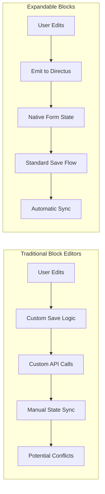

# Architecture Overview

The Expandable Blocks extension is a Vue 3 interface component for Directus that solves the complex challenge of managing Many-to-Any (M2A) relationships with inline editing capabilities.

## 🏗️ Core Architecture

### Component Structure

```
expandable-blocks/
├── src/
│   ├── interface.vue          # Main interface component (editable)
│   ├── index.ts               # Interface configuration
│   ├── interface.css          # Styles
│   ├── directus-theme.css     # CSS variables documentation
│   ├── components/
│   │   └── NestedBlocks.vue   # Nested M2A display (readonly)
│   ├── composables/
│   │   └── useExpandableBlocks.ts  # Core business logic
│   ├── utils/
│   │   ├── m2a-helper.ts      # M2A data handling
│   │   ├── helpers.ts         # Utility functions
│   │   └── logger.ts          # Debug logging
│   └── types/
│       ├── index.ts           # Core type definitions
│       └── directus.ts        # Directus-specific types
```

## 🔀 Two-Component Architecture

The extension uses a **separation of concerns** approach with two distinct Vue components:

### interface.vue (Main Component)

**Purpose**: Full CRUD operations for M2A blocks

- **Editable Interface**: Complete form editing with v-form integration
- **User Actions**: Add, edit, delete, duplicate, reorder blocks
- **State Management**: Handles dirty state, save/discard operations
- **Drag & Drop**: Implements sortable functionality
- **Permission Controls**: Respects user permissions and configuration
- **Complex Logic**: ~1400 lines handling all interface interactions

### NestedBlocks.vue (Display Component)

**Purpose**: Read-only display of nested M2A relationships

- **Readonly Display**: Shows nested content without editing capabilities
- **Recursive Rendering**: Can display deeply nested M2A structures
- **Compact UI**: Optimized for overview and navigation
- **Simple Logic**: ~130 lines focused on display and expansion
- **No State Conflicts**: Isolated from parent editing operations

### Why This Separation?

1. **Complexity Management**
   - interface.vue handles complex editing logic
   - NestedBlocks.vue focuses solely on display

2. **Performance**
   - Lighter component for nested views
   - No drag&drop or editing overhead in nested display

3. **Recursion Safety**
   - NestedBlocks can safely call itself recursively
   - Avoids state conflicts between nested levels

4. **Use Case Clarity**

```typescript
// Main editing: interface.vue
Page Content Blocks (editable)
├── Hero Block ← Full editing capabilities
├── Text Block ← Can add, edit, delete, reorder
└── Gallery Block ← All CRUD operations

// Nested display: NestedBlocks.vue  
Gallery Block → Gallery Items (readonly)
├── Image 1 ← View only, no editing
├── Image 2 ← Shows content for context
└── Image 3 ← Click to expand/collapse
```

## ⚡ Key Technologies

- **Vue 3 Composition API**: For reactive state management
- **TypeScript**: Type safety and better IDE support
- **Directus Extensions SDK**: Integration with Directus
- **VueDraggable**: Drag-and-drop functionality
- **Vite**: Fast build tool and development server

## 📘 TypeScript Architecture

The extension is built with **TypeScript Strict Mode** for maximum type safety:

### Type System

```typescript
// Core interfaces
interface ExpandableBlocksOptions {
  enableSorting?: boolean;
  startExpanded?: boolean;
  accordionMode?: boolean;
  // ... all configuration options
}

interface JunctionRecord {
  id: string | number;
  collection: string;
  item: string | number | ItemRecord;
  sort?: number;
  [foreignKey: string]: any;
}

// Directus integration types
interface DirectusFormValues {
  [key: string]: any;
}
```

### IDE Integration

**Vue Component Types** (`src/types/directus-components.d.ts`):
```typescript
declare module '@vue/runtime-core' {
  export interface GlobalComponents {
    VButton: DefineComponent<any, any, any>;
    VIcon: DefineComponent<any, any, any>;
    // ... all Directus components
  }
}
```

**CSS Custom Properties**:
- Autocomplete for all Directus CSS variables
- Hover documentation for CSS variables
- No "unknown property" warnings

## 🎯 Native Directus Integration

### The Power of Native Save

One of the key architectural decisions is to **work entirely within Directus' native form system**:



### Benefits

1. **No Custom API Calls**
   - All saves go through Directus' standard form submission
   - Respects permissions and validation automatically

2. **Native Save Options**
   - Save & Stay works perfectly
   - Save & Add Another maintains state
   - Save as Copy functions correctly

3. **Global Discard**
   - Directus' "Discard Changes" reverts all block changes
   - No orphaned or partially saved data

4. **Proper Dirty State**
   - Save button only appears when actual changes exist
   - Integrates with Directus' unsaved changes warnings

## 🔧 Composable Architecture

The core business logic is extracted into a composable:

```typescript
// useExpandableBlocks.ts
export function useExpandableBlocks(props, emit) {
  // State management
  const blocks = ref<JunctionRecord[]>([]);
  const expandedBlocks = ref<Set<string>>(new Set());
  
  // Core functions
  const addBlock = async (collection: string) => { /* ... */ };
  const updateBlock = (id: string, data: any) => { /* ... */ };
  const deleteBlock = (id: string) => { /* ... */ };
  
  // Dirty state tracking
  const isDirty = computed(() => /* ... */);
  
  return {
    blocks,
    expandedBlocks,
    addBlock,
    updateBlock,
    deleteBlock,
    isDirty
  };
}
```

This separation allows for:
- Easier testing
- Cleaner component code
- Reusable logic
- Better type inference

## 🚀 Performance Optimizations

### Render Optimization

1. **Conditional Rendering**
   ```vue
   <!-- Only render expanded content when needed -->
   <div v-if="isExpanded" class="block-content">
     <v-form v-model="item" :fields="fields" />
   </div>
   ```

2. **Component Lazy Loading**
   ```typescript
   // Lazy load heavy components
   const VForm = defineAsyncComponent(() => 
     import('@directus/components').then(m => m.VForm)
   );
   ```

3. **Computed Property Caching**
   ```typescript
   // Expensive computations cached
   const sortedBlocks = computed(() => {
     return [...items.value].sort((a, b) => 
       (a.sort || 0) - (b.sort || 0)
     );
   });
   ```

### Memory Management

1. **Cleanup on Unmount**
   ```typescript
   onUnmounted(() => {
     // Clear large data structures
     blockOriginalStates.value.clear();
     items.value = [];
     
     // Remove event listeners
     unwatchItems?.();
     unwatchValues?.();
   });
   ```

2. **Efficient State Storage**
   ```typescript
   // Store only necessary data
   function storeOriginalState(block: JunctionRecord) {
     const minimal = {
       id: block.id,
       sort: block.sort,
       item: block.item // Only item data, not full junction
     };
     blockOriginalStates.value.set(block.id, minimal);
   }
   ```

### DOM Optimization

1. **Virtual Scrolling Ready**
   ```typescript
   // Structure prepared for future virtual scrolling
   const visibleRange = computed(() => {
     const start = scrollTop.value / itemHeight;
     const end = start + visibleCount;
     return { start, end };
   });
   ```

2. **Minimal DOM Updates**
   ```typescript
   // Use key for efficient updates
   <draggable :key="item.id" />
   
   // Batch DOM operations
   nextTick(() => {
     updateAllPositions();
   });
   ```

### Network Optimization

1. **Debounced Updates**
   ```typescript
   const debouncedEmit = debounce(() => {
     emit('input', prepareItemsForEmit(items.value));
   }, 300);
   ```

2. **Minimal Payload**
   ```typescript
   // Only send changed blocks
   function prepareItemsForEmit(blocks: JunctionRecord[]) {
     return blocks.map(block => 
       isBlockDirty(block.id) ? block : block.id
     );
   }
   ```

---

> **Next**: Understand the [[Data Flow|05-Data-Flow]] or explore [[API Integration|06-API-Integration]]