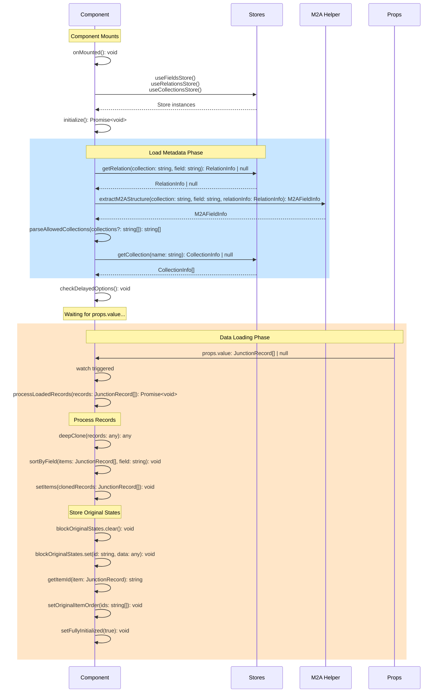
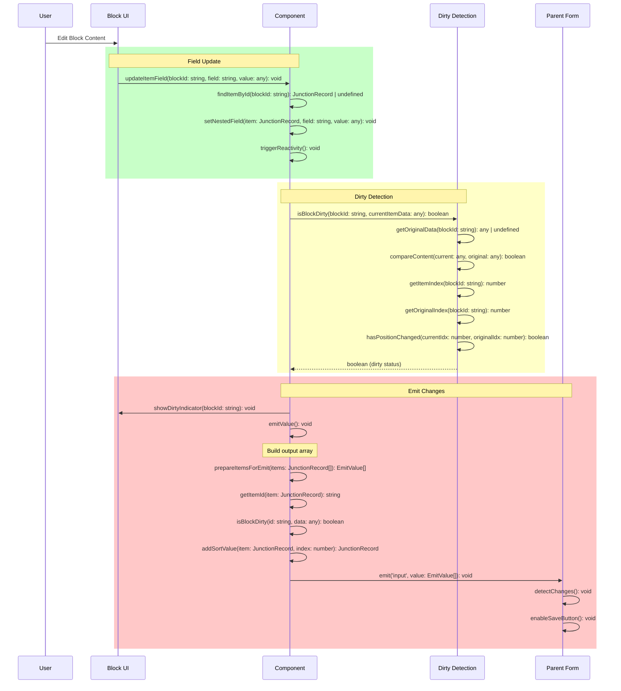
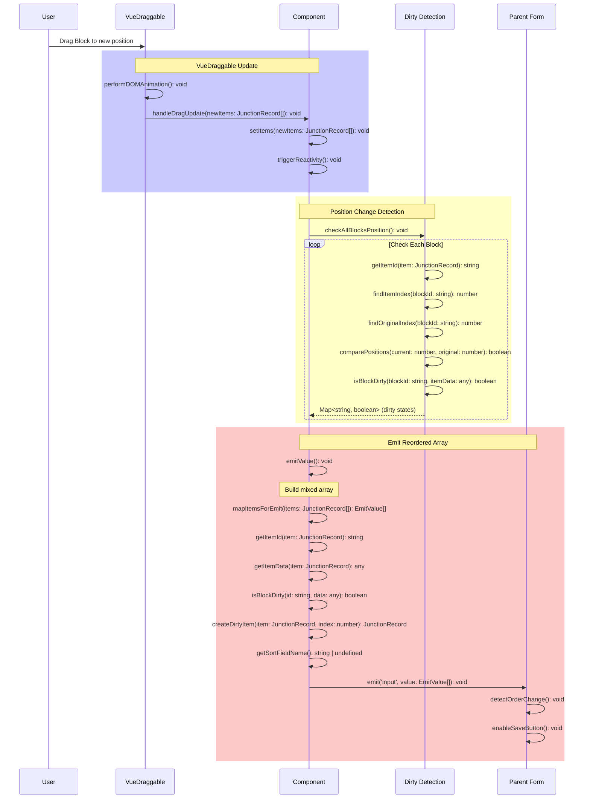
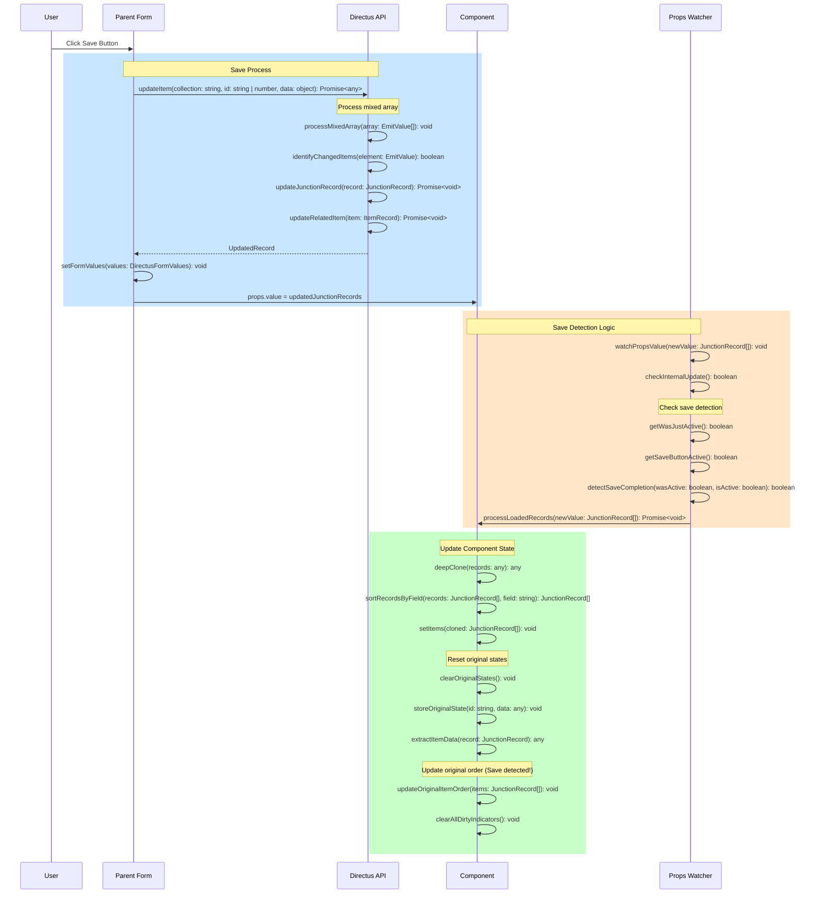
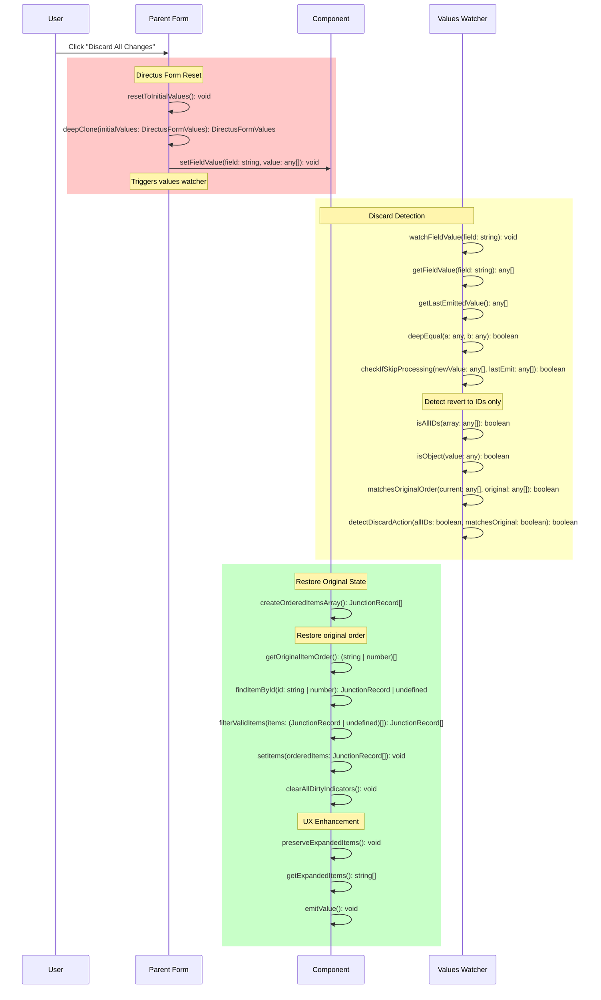
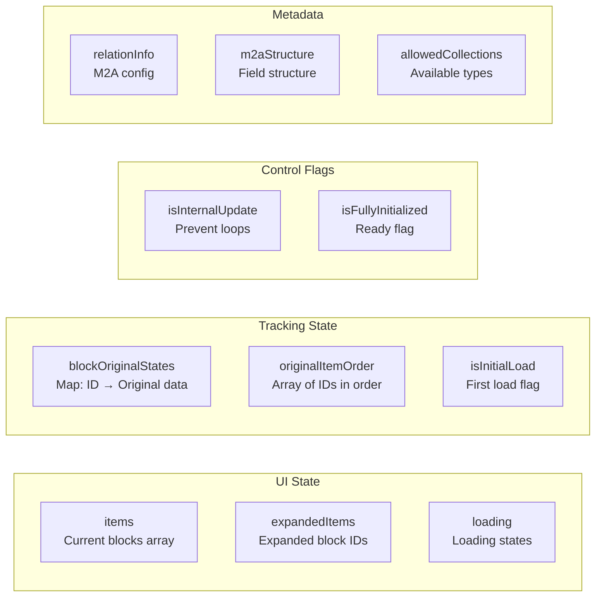
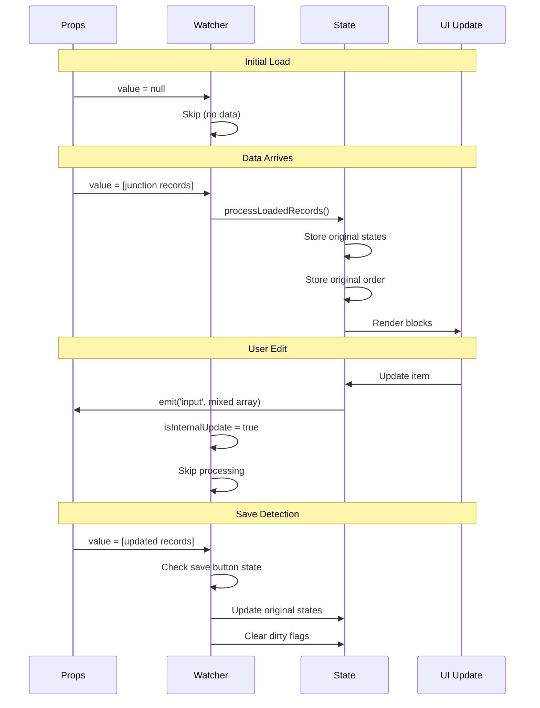

# Data Flow & State Management

Understanding how data flows through the Expandable Blocks extension is crucial for development and debugging.

## 🧩 The M2A Challenge

### Problem Statement

Directus stores M2A relationships differently than it displays them:

**Storage Format**: Array of junction IDs
```javascript
[57, 58, 59]
```

**Display Format**: Array of objects with full data
```javascript
[
  { id: 57, collection: "content_text", item: { id: 1, title: "..." } },
  { id: 58, collection: "content_image", item: { id: 2, url: "..." } }
]
```

This mismatch causes issues with dirty state detection - Directus compares the stored IDs with the displayed objects, always seeing them as different.

### Solution: Selective Emitting with Order Preservation

The extension implements a sophisticated dirty tracking system:

```typescript
// Store original state when blocks load
const blockOriginalStates = ref<Map<string, any>>(new Map());

// Store original order for accurate comparison
const originalItemOrder = ref<(string | number)[]>([]);

// Check if individual block has changes
function isBlockDirty(blockId: string, currentItemData: any): boolean {
  const originalData = blockOriginalStates.value.get(blockId);
  if (!originalData) return true; // New blocks are always dirty
  return JSON.stringify(currentItemData) !== JSON.stringify(originalData);
}

// Emit IDs for clean blocks, full objects for dirty blocks
function prepareItemsForEmit(itemsArray: JunctionRecord[]): any[] {
  const result = itemsArray.map(item => {
    const blockId = item.id?.toString();
    const isDirty = isBlockDirty(blockId, item.item);
    return isDirty ? item : item.id;
  });
  
  // If all blocks are clean, preserve original order
  const dirtyCount = result.filter(item => typeof item === 'object').length;
  if (dirtyCount === 0 && originalItemOrder.value.length > 0) {
    const itemMap = new Map(itemsArray.map(item => [item.id, item]));
    return originalItemOrder.value.filter(id => itemMap.has(id));
  }
  
  return result;
}
```

## 🌊 Component Lifecycle

### Overview

```
1. Mount Phase → 2. Data Arrival → 3. User Interaction → 4. Save Phase → (repeat)
```

### 🔄 Detailed Sequence Diagrams

#### 1️⃣ Initial Load Sequence



### 1️⃣ Mount Phase

When the component initializes:

1. **Store Initialization**
   - `useFieldsStore()` - Field metadata
   - `useRelationsStore()` - Relationship info
   - `useCollectionsStore()` - Collection details

2. **Metadata Loading**
   - Extract M2A structure
   - Parse allowed collections
   - Load collection icons and names

3. **Wait for Data**
   - Component ready but no blocks shown
   - Waiting for props.value to populate

### 2️⃣ Data Arrival Phase

When Directus provides data:

1. **Props Watcher Triggered**
   ```typescript
   watch(() => props.value, async (newValue) => {
     if (newValue && Array.isArray(newValue)) {
       await processLoadedRecords(newValue);
     }
   });
   ```

2. **Process Records**
   - Deep clone to avoid mutations
   - Sort by sort field
   - Store original states
   - Track original order

3. **UI Ready**
   - Blocks displayed
   - Ready for interaction

### 3️⃣ Interaction Phase

User interactions and state tracking:

#### User Edit Sequence



#### Drag & Drop Sequence



1. **User Actions**
   - Edit block content
   - Reorder blocks
   - Add/delete blocks
   - Duplicate blocks

2. **Dirty State Tracking**
   ```typescript
   // Content changes
   const contentDirty = blocks.some(block => 
     isBlockDirty(block.id, block.item)
   );
   
   // Order changes
   const orderDirty = !arraysEqual(
     currentOrder,
     originalOrder
   );
   
   // Overall dirty state
   const isDirty = contentDirty || orderDirty;
   ```

3. **Emit Changes**
   ```typescript
   emit('input', prepareItemsForEmit(blocks));
   ```

### 4️⃣ Save Phase

When parent form saves:

#### Save & Update Sequence



1. **Save Detection**
   ```typescript
   function detectSave(newRecords: JunctionRecord[]): boolean {
     // New IDs indicate successful save
     const hasNewIds = newRecords.some(record => 
       !blockOriginalStates.has(record.id)
     );
     
     // All blocks have integer IDs after save
     const allIntegerIds = newRecords.every(record =>
       typeof record.id === 'number'
     );
     
     return hasNewIds || allIntegerIds;
   }
   ```

2. **State Reset**
   - Update original states
   - Clear dirty flags
   - Update original order

3. **Continue Cycle**
   - Ready for new changes

### 5️⃣ Global Discard Sequence



**UX Enhancement**: Unlike standard interfaces, expanded blocks remain open after discard operations.

## 💾 State Management Details

### Block States

Each block maintains several states:

```typescript
interface BlockState {
  // Identity
  id: string | number;
  tempId?: string;         // For new blocks
  
  // Data
  item: any;               // Actual content
  collection: string;      // Block type
  
  // Metadata
  sort?: number;           // Order position
  isExpanded: boolean;     // UI state
  isDirty: boolean;        // Change tracking
}
```

### Dirty State Categories

1. **New Blocks**
   - Temporary IDs (uuid)
   - Always considered dirty
   - Full object emitted

2. **Modified Blocks**
   - Content changed
   - Detected via deep comparison
   - Full object emitted

3. **Moved Blocks**
   - Position changed
   - Sort value updated
   - Full object emitted if moved

4. **Clean Blocks**
   - No changes
   - Only ID emitted
   - Reduces payload size

### Optimization Strategies

1. **Selective Emitting**
   ```typescript
   // Only send changed data
   const payload = blocks.map(block => 
     block.isDirty ? block : block.id
   );
   ```

2. **Debounced Updates**
   ```typescript
   const debouncedEmit = debounce(() => {
     emit('input', prepareItemsForEmit(blocks));
   }, 300);
   ```

3. **Efficient Comparisons**
   ```typescript
   // Fast string comparison for content
   const contentHash = JSON.stringify(block.item);
   const hasChanged = contentHash !== originalHash;
   ```

## 📊 Core State Variables

### State Variable Architecture



## ⚡ Critical Timing Details

### The Props.value Watcher Implementation

The most critical piece of the data flow is the props.value watcher. Here's the complete implementation with timing details:

```typescript
watch(() => props.value, async (newValue) => {
  // 1. Skip if we caused this update
  if (isInternalUpdate.value) {
    isInternalUpdate.value = false
    return
  }
  
  // 2. Wait for collections to be ready
  if (allowedCollections.value.length === 0) {
    await nextTick()
    checkDelayedOptions()
  }
  
  // 3. Process the loaded records
  await processLoadedRecords(newValue)
  
  // 4. Mark as initialized
  isFullyInitialized.value = true
  
  // 5. Store original order for dirty detection
  originalItemOrder.value = items.value.map(item => getItemId(item))
  
  // 6. CRITICAL: Detect save completion
  if (saveButtonWouldBeActive.value === false && wasJustActive.value) {
    // Save just completed - update original order!
    originalItemOrder.value = [...items.value.map(item => getItemId(item))]
    
    // Clear all dirty states after successful save
    blockOriginalStates.value.clear()
    items.value.forEach(item => {
      const blockId = getItemId(item)
      const itemData = extractItemData(item)
      blockOriginalStates.value.set(blockId, deepClone(itemData))
    })
  }
  
  wasJustActive.value = saveButtonWouldBeActive.value
}, { immediate: true, deep: true })
```

### Critical Timing Sequence



## 🎯 Critical Watchers

### Store Value Watcher

```typescript
// Watch the actual form value in the store
const storeValue = computed(() => {
  const values = useFieldsStore().values?.[props.field]
  return values || []
})

watch(storeValue, (newValue) => {
  // Detect when Directus reverts to ID-only array
  if (isAllIds(newValue) && !isInternalUpdate.value) {
    // This is a discard operation!
    handleDiscardDetected()
  }
})
```

### Save Button State Tracking

```typescript
// Track save button state for save detection
const saveButtonWouldBeActive = computed(() => {
  const fieldsStore = useFieldsStore()
  return fieldsStore.hasEdits
})

let wasJustActive = false

// Critical: Update this flag in the watcher
watch(saveButtonWouldBeActive, (isActive) => {
  if (!isActive && wasJustActive) {
    // Save just completed!
    updateOriginalStatesAfterSave()
  }
  wasJustActive = isActive
})
```

## 🔍 Debugging State

Enable debug mode to track state changes:

```javascript
{
  "options": {
    "debugMode": true
  }
}
```

This logs:
- State transitions
- Dirty state calculations
- Emit payloads
- Save detection
- Critical timing events
- Watcher triggers

### Debug Helper Function

```typescript
function debugLog(action: string, data?: any) {
  if (!props.options?.debugMode) return
  
  console.group(`[ExpandableBlocks] ${action}`)
  console.log('Time:', new Date().toISOString())
  console.log('Component ID:', componentId)
  
  if (data) {
    console.log('Data:', data)
  }
  
  console.log('Current State:', {
    items: items.value.length,
    expanded: expandedItems.value,
    dirty: Array.from(blockOriginalStates.value.keys()).filter(id => 
      isBlockDirty(id, findItemById(id)?.item)
    ),
    initialized: isFullyInitialized.value
  })
  
  console.groupEnd()
}
```

---

> **Next**: Learn about [[API Integration|06-API-Integration]] or explore [[Development|07-Development]] guide