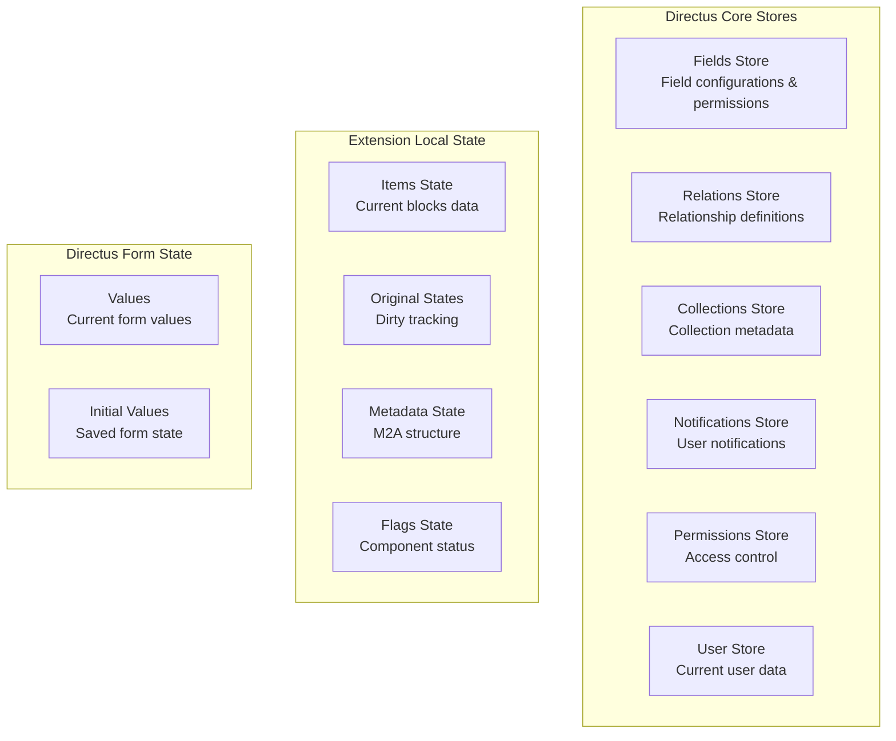
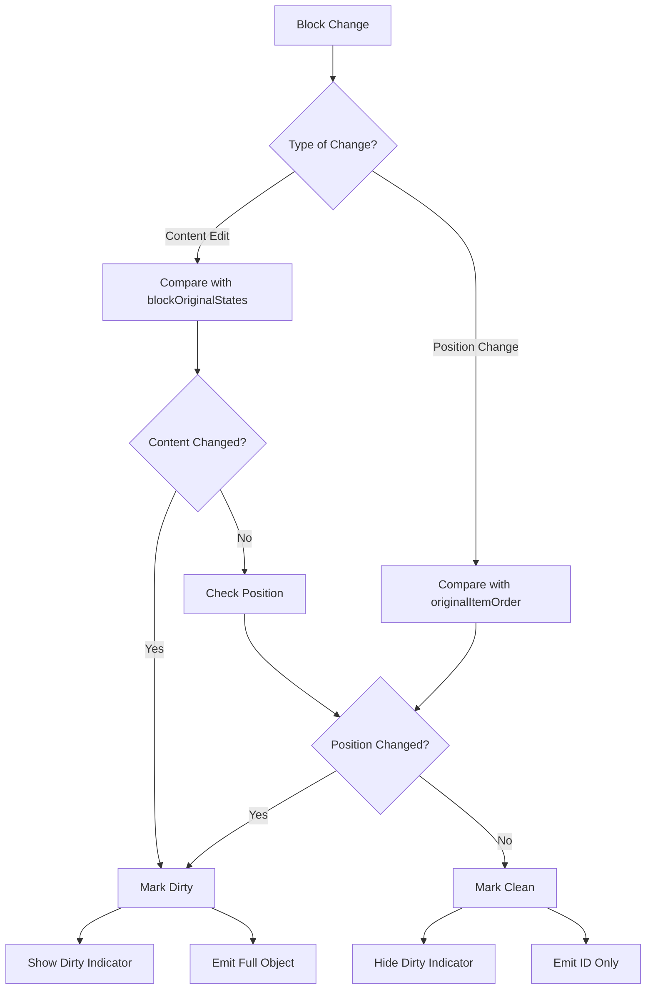
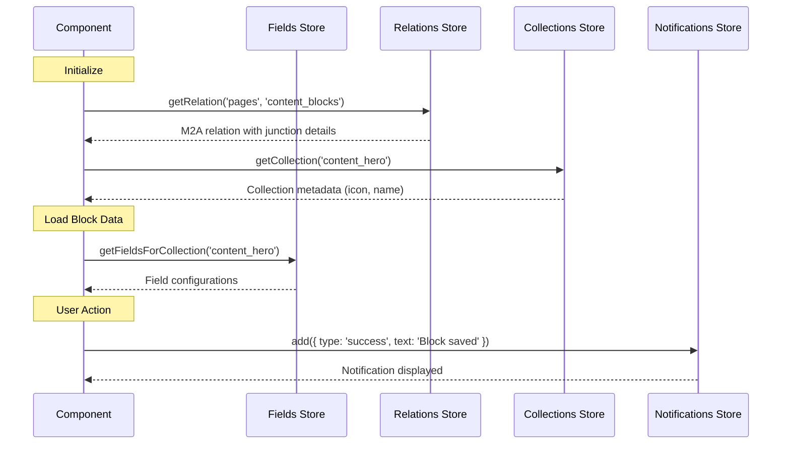

# API Integration & Store Architecture

This page covers how Expandable Blocks integrates with Directus APIs and stores.

## 🔌 Native Directus Integration

### Key Principle: Work WITH Directus, Not Around It

Instead of custom API calls:
```typescript
// ❌ Traditional approach - bypass Directus
await api.post('/items/blocks', blockData)

// ✅ Our approach - emit to Directus
emit('input', mixedArray)
```

Directus then handles:
- Validation
- Permissions
- API calls
- Error handling
- Success feedback

## 🏪 Store Architecture

### Store Overview Diagram



### 📦 Directus Core Stores - Detailed Reference

#### 1. Fields Store (`useFieldsStore`)

Manages field metadata and configurations:

```typescript
interface DirectusFieldsStore {
  // Methods
  getFieldsForCollection(collection: string): Field[]
  getField(collection: string, field: string): Field | null
  getFieldsForCollections(collections: string[]): Field[]
  getPrimaryKeyFieldForCollection(collection: string): Field | null
  
  // Data Structure
  fields: Field[]
}

interface Field {
  collection: string
  field: string
  type: string // 'string', 'integer', 'datetime', etc.
  schema: {
    is_primary_key?: boolean
    is_nullable?: boolean
    default_value?: any
    max_length?: number
    numeric_precision?: number
    numeric_scale?: number
  }
  meta: {
    interface?: string // 'input', 'datetime', 'expandable-blocks', etc.
    display?: string
    display_options?: Record<string, any>
    readonly?: boolean
    hidden?: boolean
    width?: 'half' | 'full'
    translations?: Record<string, string>
    required?: boolean
    options?: Record<string, any>
    special?: string[] // ['m2a', 'file', 'cast-json', etc.]
  }
}

// Usage in Extension
const fieldsStore = useFieldsStore()
const fields = fieldsStore.getFieldsForCollection('content_blocks')
const primaryKey = fieldsStore.getPrimaryKeyFieldForCollection('pages')
```

#### 2. Relations Store (`useRelationsStore`)

Handles relationship definitions between collections:

```typescript
interface DirectusRelationsStore {
  // Methods
  getRelation(collection: string, field: string): RelationInfo | null
  getRelationsForCollection(collection: string): RelationInfo[]
  getRelationsForField(collection: string, field: string): RelationInfo[]
  
  // Data
  relations: RelationInfo[]
}

interface RelationInfo {
  id: number
  many_collection: string // Junction table
  many_field: string // Foreign key in junction
  one_collection: string | null // Can be null for M2A
  one_field: string | null
  one_collection_field?: string // For M2A
  one_allowed_collections?: string[] // For M2A
  junction_field?: string
  sort_field?: string // Important for ordering!
  one_deselect_action: 'nullify' | 'delete'
  
  meta?: {
    sort_field?: string // Sort field in junction table
    one_field?: string
    junction_field?: string
    one_allowed_collections?: string[]
    one_collection_field?: string
  }
}

// Usage Example
const relationsStore = useRelationsStore()
const relation = relationsStore.getRelation('pages', 'content_blocks')
// Returns: M2A relation info with junction table details
```

#### 3. Collections Store (`useCollectionsStore`)

Provides collection metadata and configurations:

```typescript
interface DirectusCollectionsStore {
  // Methods
  getCollection(name: string): Collection | null
  collections: Collection[]
  
  // Computed
  visibleCollections: Collection[]
  allCollections: Collection[]
}

interface Collection {
  collection: string
  meta: {
    collection: string
    icon?: string // 'box', 'article', 'image', etc.
    display_template?: string // "{{title}} - {{status}}"
    hidden?: boolean
    singleton?: boolean
    translations?: Record<string, string>
    archive_field?: string
    archive_value?: string
    unarchive_value?: string
    archive_app_filter?: boolean
    sort_field?: string
    group?: string
    collapse?: 'open' | 'closed' | 'locked'
    collection_divider?: boolean
    sort?: number
    accountability?: 'all' | 'activity' | null
    color?: string
    item_duplication_fields?: string[] | null
    note?: string
  }
  schema: {
    name: string
    comment?: string
  }
}

// Usage Example
const collectionsStore = useCollectionsStore()
const collection = collectionsStore.getCollection('content_hero')
const icon = collection?.meta?.icon || 'box'
const displayTemplate = collection?.meta?.display_template
```

#### 4. Notifications Store (`useNotificationsStore`)

Manages user notifications and feedback:

```typescript
interface DirectusNotificationsStore {
  // Methods
  add(notification: NotificationOptions): string // Returns ID
  remove(id: string): void
  update(id: string, updates: Partial<NotificationOptions>): void
  
  // Data
  queue: Notification[]
}

interface NotificationOptions {
  title?: string
  text?: string
  type?: 'info' | 'success' | 'warning' | 'error'
  persist?: boolean
  closeable?: boolean
  duration?: number // milliseconds
  icon?: string
  loading?: boolean
  progress?: number // 0-100
  actions?: Array<{
    text: string
    action: () => void
    color?: string
  }>
}

// Usage Examples
const notificationsStore = useNotificationsStore()

// Success notification
notificationsStore.add({
  title: 'Success',
  text: 'Block saved successfully',
  type: 'success'
})

// Error with action
notificationsStore.add({
  title: 'Error Loading Block',
  text: 'Failed to load block data',
  type: 'error',
  persist: true,
  actions: [{
    text: 'Retry',
    action: () => loadFullItemData(blockId)
  }]
})
```

#### 5. Permissions Store (`usePermissionsStore`)

Controls access and permissions:

```typescript
interface DirectusPermissionsStore {
  // Methods
  hasPermission(collection: string, action: string): boolean
  getFieldPermissions(collection: string): FieldPermissions
  
  // Data
  permissions: Permission[]
}

interface Permission {
  id: number
  role: string
  collection: string
  action: 'create' | 'read' | 'update' | 'delete'
  permissions: Record<string, any> | null
  validation: Record<string, any> | null
  presets: Record<string, any> | null
  fields: string[] | null
}

// Usage
const permissionsStore = usePermissionsStore()
const canDelete = permissionsStore.hasPermission('content_blocks', 'delete')
const canUpdate = permissionsStore.hasPermission('content_blocks', 'update')
```

#### 6. User Store (`useUserStore`)

Current user information:

```typescript
interface DirectusUserStore {
  // Current user data
  currentUser: User | null
  loading: boolean
  error: any | null
  
  // Methods
  hydrate(): Promise<void>
  dehydrate(): void
}

interface User {
  id: string
  first_name: string
  last_name: string
  email: string
  avatar: string | null
  language: string
  theme: 'light' | 'dark' | 'auto'
  role: {
    id: string
    name: string
    admin_access: boolean
    app_access: boolean
  }
}

// Usage
const userStore = useUserStore()
const isAdmin = userStore.currentUser?.role?.admin_access || false
const userTheme = userStore.currentUser?.theme || 'auto'
```

### Form Integration

The extension integrates with Directus form system:

```typescript
// Access form values
const values = inject('values', ref<Record<string, any>>({}));
const initialValues = inject('initialValues', ref<Record<string, any>>({}));

// Emit changes
function emitValue() {
  const preparedValue = prepareItemsForEmit(items.value);
  emit('input', preparedValue);
}
```

## 📡 Data Flow Sequences

### 1️⃣ Block Creation

```typescript
async function addBlock(collection: string) {
  // Generate temporary ID
  const tempId = uuid();
  
  // Create new junction record
  const newJunction: JunctionRecord = {
    id: tempId,
    collection: collection,
    item: {},
    sort: getNextSortValue()
  };
  
  // Add to local state
  items.value.push(newJunction);
  
  // Emit to Directus
  emitValue();
}
```

### 2️⃣ Block Update

```typescript
function updateBlockContent(blockId: string, fieldKey: string, value: any) {
  const block = findBlock(blockId);
  if (!block) return;
  
  // Update nested data
  if (typeof block.item === 'object') {
    block.item[fieldKey] = value;
  }
  
  // Mark as dirty
  blockDirtyStates.value.set(blockId, true);
  
  // Emit changes
  emitValue();
}
```

### 3️⃣ Save Process

When user clicks save:

1. **Parent form collects all field values**
2. **Sends to Directus API**
3. **API processes mixed array**:
   ```typescript
   // Mixed array example
   [
     "57",                    // Clean block - just ID
     {                        // Dirty block - full object
       id: "58",
       collection: "content_text",
       item: { title: "Updated" }
     },
     {                        // New block - temp ID
       id: "temp-uuid-123",
       collection: "content_image",
       item: { url: "..." }
     }
   ]
   ```

4. **Directus creates/updates records**
5. **Returns saved data with real IDs**
6. **Component updates state**

### 4️⃣ Permission Checks

```typescript
// Check collection permissions
function canCreateInCollection(collection: string): boolean {
  const permissions = permissionsStore.getPermissionsForCollection(collection);
  return permissions?.create?.access === 'full';
}

// Check field permissions
function canEditField(collection: string, field: string): boolean {
  const permissions = permissionsStore.getFieldPermissions(collection);
  return permissions?.[field]?.write === true;
}
```

## 🔄 Reactive Updates

### Values Watcher

Monitors form field changes:

```typescript
watch(
  () => values.value?.[props.field],
  (newFieldValue) => {
    if (shouldSkipUpdate(newFieldValue)) return;
    
    // Handle external updates
    if (isExternalUpdate(newFieldValue)) {
      loadExternalData(newFieldValue);
    }
  }
);
```

### Props Watcher

Monitors incoming data:

```typescript
watch(
  () => props.value,
  async (newValue) => {
    if (!newValue || !Array.isArray(newValue)) return;
    
    // Detect save completion
    if (detectSaveCompletion()) {
      await processLoadedRecords(newValue);
      resetDirtyStates();
    }
  }
);
```

## 🛡️ Error Handling

### API Error Handling

```typescript
try {
  await processRecords();
} catch (error) {
  if (error.response?.status === 403) {
    notify({
      type: 'error',
      title: 'Permission Denied',
      text: 'You do not have permission to edit this block'
    });
  } else {
    notify({
      type: 'error',
      title: 'Error',
      text: error.message || 'An error occurred'
    });
  }
}
```

### Validation Integration

Directus validates before save:

```typescript
// Required fields enforced
if (!block.item.title && fieldRequired('title')) {
  // Directus shows validation error
  // Save button disabled
}

// Custom validation rules applied
if (customValidation && !customValidation(block.item)) {
  // Directus prevents save
}
```

## 🎯 Best Practices

### 1. Always Emit Arrays

```typescript
// ✅ Correct
emit('input', [item1, item2, item3]);

// ❌ Wrong
emit('input', item1);
```

### 2. Preserve Junction IDs

```typescript
// ✅ Keep existing IDs
const updated = {
  ...existingJunction,
  item: { ...existingJunction.item, title: 'New' }
};

// ❌ Don't create new IDs
const wrong = {
  id: uuid(), // This creates duplicate!
  item: { title: 'New' }
};
```

### 3. Handle Loading States

```typescript
const loading = computed(() => {
  return !relationInfo.value || !collectionsInfo.value;
});
```

### 4. Respect Permissions

```typescript
// Check before showing actions
const showAddButton = computed(() => {
  return allowedCollections.value.some(col => 
    canCreateInCollection(col)
  );
});
```

## 📊 Type Definitions

### Core Interfaces

```typescript
// Main component props
interface UseExpandableBlocksProps {
  value: JunctionRecord[] | null
  collection: string
  field: string
  primaryKey?: string | number
  disabled?: boolean
  options?: ExpandableBlocksOptions
}

// Junction record structure
interface JunctionRecord {
  id: string | number
  collection: string
  item: string | number | ItemRecord
  sort?: number
  [foreignKey: string]: any // Additional foreign keys
}

// Item data structure
interface ItemRecord {
  id: string | number
  [field: string]: any // Dynamic fields based on collection
}

// M2A field metadata
interface M2AFieldInfo {
  collection: string
  field: string
  itemField: string
  junctionCollection: string
  junctionPrimaryKey: string
}

// Relation metadata from Directus
interface RelationInfo {
  collection: string
  field: string
  related_collection: string | null
  meta?: {
    sort_field?: string
    one_allowed_collections?: string[]
    one_field?: string
    junction_field?: string
  }
}

// Collection metadata
interface CollectionInfo {
  collection: string
  name: string
  icon: string
  meta?: {
    display_template?: string
    singleton?: boolean
  }
}

// Component options
interface ExpandableBlocksOptions {
  enableSorting?: boolean
  showItemId?: boolean
  startExpanded?: boolean
  accordionMode?: boolean
  showFieldsFilter?: string[]
  compactMode?: boolean
  isAllowedDelete?: boolean
  isAllowedDuplicate?: boolean
  maxBlocks?: number
  allowedCollections?: string[]
}
```

## 🔍 Dirty State Detection Flow



## 🔄 Store Interaction Flow



---

> **Next**: Explore the [[Development|07-Development]] guide or see [[Examples|08-Examples]]