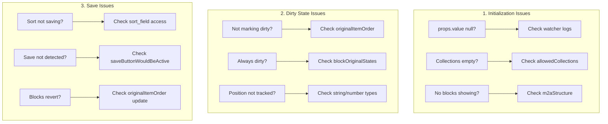
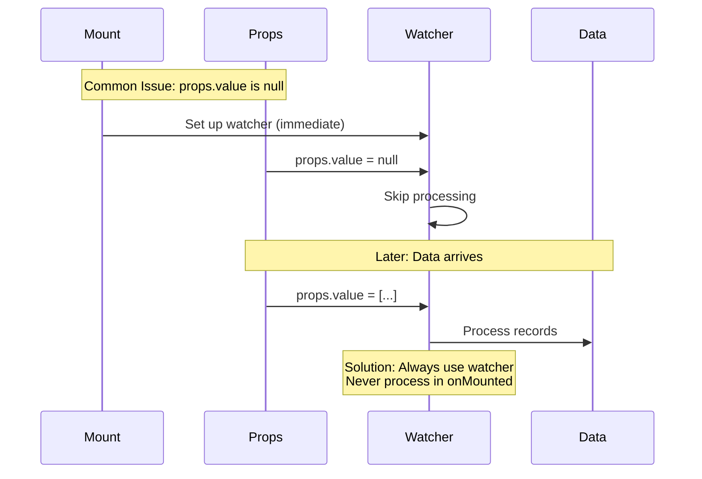

# Development Guide

This guide covers development setup, debugging, and best practices for working with the Expandable Blocks extension.

## 🛠️ Development Setup

### Prerequisites

- Node.js 16.x or higher
- npm or yarn
- Directus instance running locally
- TypeScript knowledge recommended

### Getting Started

1. **Clone the Repository**
   ```bash
   git clone https://github.com/smartlabsAT/directus-expandable-blocks.git
   cd directus-expandable-blocks
   ```

2. **Install Dependencies**
   ```bash
   npm install
   ```

3. **Start Development Mode**
   ```bash
   npm run dev
   ```

   This starts a watcher that automatically rebuilds on changes.

### Development Commands

```bash
npm run dev          # Start development mode with watcher
npm run build-dev    # Single build without minification
npm run test         # Run unit tests
npm run test:e2e     # Run E2E tests
npm run lint         # Check code style
npm run typecheck    # Run TypeScript checks
```

## 🐛 Debugging

### Enable Debug Mode

Add to your field configuration:

```javascript
{
  "options": {
    "debugMode": true
  }
}
```

### Console Logging

The extension includes a logger utility:

```typescript
import { logger } from './utils/logger';

// Debug mode required for output
logger.log('Block data:', blockData);
logger.warn('Missing configuration');
logger.error('Failed to load:', error);
logger.group('Processing blocks');
logger.groupEnd();
```

### Browser DevTools

1. **Vue DevTools**
   - Install Vue DevTools extension
   - Inspect component state and props
   - Track reactive updates

2. **Network Tab**
   - Monitor API calls
   - Check payload sizes
   - Verify response data

3. **Performance Tab**
   - Profile drag operations
   - Identify render bottlenecks
   - Optimize large datasets

### Common Debugging Scenarios

#### 1. Blocks Not Saving

```typescript
// Check emit payload
logger.log('Emitting:', prepareItemsForEmit(items.value));

// Verify dirty state
logger.log('Dirty blocks:', Array.from(blockDirtyStates.value.entries()));

// Check form values
logger.log('Form field value:', values.value[props.field]);
```

#### 2. Drag & Drop Issues

```typescript
// Monitor drag events
function handleDragUpdate(newItems) {
  logger.group('Drag Update');
  logger.log('Old order:', items.value.map(i => i.id));
  logger.log('New order:', newItems.map(i => i.id));
  logger.groupEnd();
}
```

#### 3. State Management

```typescript
// Track state changes
watch(items, (newItems, oldItems) => {
  logger.log('Items changed:', { old: oldItems, new: newItems });
}, { deep: true });

// Monitor dirty detection
watch(isDirty, (dirty) => {
  logger.log('Dirty state:', dirty);
});
```

## 🧪 Testing

### Unit Tests

Located in `src/**/*.test.ts`:

```typescript
// Example test
describe('useExpandableBlocks', () => {
  it('should track dirty state correctly', () => {
    const { isDirty, updateBlock } = useExpandableBlocks(props, emit);
    
    expect(isDirty.value).toBe(false);
    
    updateBlock('1', { title: 'New Title' });
    
    expect(isDirty.value).toBe(true);
  });
});
```

Run tests:
```bash
npm run test         # Run once
npm run test:watch   # Watch mode
npm run test:coverage # With coverage
```

### E2E Tests

Located in `tests/e2e/`:

```typescript
test('should add new block', async ({ page }) => {
  await page.goto('/admin/content/pages/1');
  
  await page.click('[data-test="add-block-button"]');
  await page.click('[data-test="collection-content_text"]');
  
  await expect(page.locator('.expandable-block')).toHaveCount(1);
});
```

Run E2E tests:
```bash
npm run test:e2e        # Headless
npm run test:e2e:ui     # With UI
npm run test:e2e:debug  # Debug mode
```

## 📝 Code Style

### TypeScript Guidelines

1. **Use Strict Mode**
   ```typescript
   // tsconfig.json
   {
     "compilerOptions": {
       "strict": true
     }
   }
   ```

2. **Type Everything**
   ```typescript
   // ✅ Good
   function updateBlock(id: string, data: Partial<ItemRecord>): void
   
   // ❌ Bad
   function updateBlock(id: any, data: any): any
   ```

3. **Use Interfaces**
   ```typescript
   interface BlockState {
     id: string;
     isDirty: boolean;
     isExpanded: boolean;
   }
   ```

### Vue Composition API

1. **Group Related Logic**
   ```typescript
   // Drag & drop logic
   const { items, handleDragStart, handleDragEnd } = useDragAndDrop();
   
   // Dirty state logic
   const { isDirty, markDirty, resetDirty } = useDirtyTracking();
   ```

2. **Use Computed for Derived State**
   ```typescript
   const hasChanges = computed(() => 
     items.value.some(item => isBlockDirty(item.id))
   );
   ```

3. **Prefer Refs Over Reactive**
   ```typescript
   // ✅ Good
   const items = ref<JunctionRecord[]>([]);
   
   // ⚠️ Avoid unless needed
   const state = reactive({ items: [] });
   ```

## 🏗️ Extension Structure

### Key Files

```
src/
├── interface.vue          # Main component
├── composables/
│   └── useExpandableBlocks.ts  # Core logic
├── utils/
│   ├── m2a-helper.ts     # M2A utilities
│   ├── logger.ts         # Debug logging
│   └── helpers.ts        # General utilities
├── types/
│   ├── index.ts          # Core types
│   └── directus.ts       # Directus types
└── components/
    └── NestedBlocks.vue  # Nested display
```

### Adding Features

1. **New Utility Function**
   ```typescript
   // utils/my-feature.ts
   export function myFeature(data: any): any {
     // Implementation
   }
   
   // Add tests
   // utils/my-feature.test.ts
   ```

2. **New Composable**
   ```typescript
   // composables/useMyFeature.ts
   export function useMyFeature() {
     const state = ref();
     
     function action() {
       // Logic
     }
     
     return { state, action };
   }
   ```

3. **New Component**
   ```vue
   <!-- components/MyComponent.vue -->
   <template>
     <div class="my-component">
       <!-- Template -->
     </div>
   </template>
   
   <script setup lang="ts">
   // Logic
   </script>
   
   <style scoped>
   /* Styles */
   </style>
   ```

## 🚀 Performance Optimization

### Large Datasets

1. **Virtual Scrolling** (planned for v5.0)
   ```typescript
   // Future implementation
   const visibleItems = computed(() => 
     items.value.slice(startIndex, endIndex)
   );
   ```

2. **Debounce Updates**
   ```typescript
   const debouncedEmit = debounce(() => {
     emit('input', prepareItemsForEmit(items.value));
   }, 300);
   ```

3. **Lazy Loading**
   ```typescript
   async function loadBlockContent(blockId: string) {
     if (loadedBlocks.has(blockId)) return;
     
     const content = await fetchBlockContent(blockId);
     loadedBlocks.set(blockId, content);
   }
   ```

### Memory Management

1. **Clean Up Watchers**
   ```typescript
   onUnmounted(() => {
     unwatchItems?.();
     unwatchValues?.();
   });
   ```

2. **Clear Large Objects**
   ```typescript
   onUnmounted(() => {
     blockOriginalStates.value.clear();
     items.value = [];
   });
   ```

## 🔒 Security Considerations

### Input Validation

1. **Always Validate Input**
   ```typescript
   function updateBlock(id: string, data: any) {
     if (!isValidId(id)) return;
     if (!isValidData(data)) return;
     // Process update
   }
   ```

2. **Sanitize User Content**
   ```typescript
   import DOMPurify from 'dompurify';
   
   function sanitizeHtml(html: string): string {
     return DOMPurify.sanitize(html);
   }
   ```

### Permission Enforcement

```typescript
// Check permissions before actions
const canCreate = computed(() => 
  allowedCollections.value.some(col => 
    permissionsStore.hasPermission(col, 'create')
  )
);

const canUpdate = computed(() => 
  permissionsStore.hasPermission(props.collection, 'update')
);

const canDelete = computed(() => 
  props.isAllowedDelete && 
  permissionsStore.hasPermission(props.collection, 'delete')
);
```

### XSS Prevention

- Never use `v-html` with user content
- Sanitize all HTML content
- Use text interpolation for user data
- Validate URLs before rendering

## ❌ Error Handling & Recovery

### User-Friendly Notifications

```typescript
const notify = (notification: NotificationOptions) => {
  notificationsStore.add(notification);
};

// Success notification
notify({
  title: 'Success',
  text: 'Block saved successfully',
  type: 'success'
});

// Error with retry
notify({
  title: 'Error Loading Block',
  text: 'Failed to load block data',
  type: 'error',
  persist: true,
  actions: [{
    text: 'Retry',
    action: () => retryLoad(blockId)
  }]
});
```

### Network Failure Recovery

```typescript
async function loadWithRetry(blockId: string, retries = 3) {
  for (let i = 0; i < retries; i++) {
    try {
      return await loadBlockData(blockId);
    } catch (error) {
      if (i === retries - 1) throw error;
      
      // Exponential backoff
      await new Promise(resolve => 
        setTimeout(resolve, Math.pow(2, i) * 1000)
      );
    }
  }
}
```

### State Recovery

```typescript
// Auto-save draft
const draftKey = `expandable-blocks-draft-${props.primaryKey}`;

function saveDraft() {
  localStorage.setItem(draftKey, JSON.stringify({
    blocks: items.value,
    timestamp: Date.now()
  }));
}

function recoverDraft() {
  const draft = localStorage.getItem(draftKey);
  if (draft) {
    const { blocks, timestamp } = JSON.parse(draft);
    // Check if draft is recent (< 1 hour)
    if (Date.now() - timestamp < 3600000) {
      return blocks;
    }
  }
  return null;
}
```

## 🎨 CSS Architecture

### Directus CSS Variables

```css
/* Use Directus theme variables */
.expandable-block {
  background: var(--theme--background);
  border: 1px solid var(--theme--border-color);
  border-radius: var(--theme--border-radius);
}

.block-header {
  background: var(--theme--background-accent);
  color: var(--theme--foreground);
}

/* Status indicators */
.status-published { color: var(--theme--success); }
.status-draft { color: var(--theme--warning); }
.status-archived { color: var(--theme--danger); }
```

### Responsive Design

```css
/* Mobile-first approach */
.expandable-blocks {
  padding: var(--theme--form--row-gap);
}

@media (min-width: 768px) {
  .expandable-blocks {
    padding: calc(var(--theme--form--row-gap) * 1.5);
  }
  
  .block-actions {
    flex-direction: row;
  }
}

@media (min-width: 1024px) {
  .block-content {
    display: grid;
    grid-template-columns: 1fr 1fr;
    gap: var(--theme--form--row-gap);
  }
}
```

### Theme Integration

```css
/* Light/Dark theme support */
[data-theme="light"] .expandable-block {
  box-shadow: 0 2px 4px rgba(0, 0, 0, 0.1);
}

[data-theme="dark"] .expandable-block {
  box-shadow: 0 2px 4px rgba(0, 0, 0, 0.3);
}

/* Hover states */
.block-header:hover {
  background: var(--theme--background-accent-hover);
}
```

## 🏁 Migration Guide

### From Standard M2A Interface

1. **Data Structure**: Compatible - no data migration needed
2. **Field Configuration**: Update interface type in Directus
3. **Permissions**: Same permission model applies

### Version Upgrades

```javascript
// Check version compatibility
const currentVersion = '1.0.6';
const minDirectusVersion = '11.0.0';

function checkCompatibility() {
  const directusVersion = systemStore.info?.version;
  if (!directusVersion) return false;
  
  return compareVersions(directusVersion, minDirectusVersion) >= 0;
}
```

### Breaking Changes

- v2.0.0: AI features may change data structure
- v3.0.0: UI customization may affect existing styles
- v5.0.0: Performance optimizations may change API

## 🐛 Debugging & Troubleshooting

### 🎯 Key Debug Points



### 🔧 Debug Helper Functions

```typescript
// Add to component for debugging
const debugState = computed(() => ({
  itemCount: items.value.length,
  dirtyBlocks: items.value.filter((item, idx) => {
    const id = getItemId(item)
    const data = item[m2aStructure.value?.itemField || '']
    return isBlockDirty(id, data)
  }).map(item => getItemId(item)),
  originalOrder: originalItemOrder.value,
  currentOrder: items.value.map(item => getItemId(item)),
  sortField: relationInfo.value?.meta?.sort_field,
  isFullyInitialized: isFullyInitialized.value
}))

// Track specific block
function debugBlock(blockId: string) {
  const item = items.value.find(i => getItemId(i) === blockId)
  console.log('Block Debug:', {
    id: blockId,
    currentIndex: items.value.findIndex(i => getItemId(i) === blockId),
    originalIndex: originalItemOrder.value.indexOf(blockId),
    isDirty: isBlockDirty(blockId, item?.[m2aStructure.value?.itemField || '']),
    originalState: blockOriginalStates.value.get(blockId),
    currentState: item?.[m2aStructure.value?.itemField || '']
  })
}
```

### 💡 Common Issues & Solutions

| Issue | Cause | Solution |
|-------|-------|----------|
| Blocks not loading | `props.value` is null on mount | Use immediate watcher |
| Sort not persisting | Wrong sort field path | Use `relationInfo.value?.meta?.sort_field` |
| Blocks jump after save | `originalItemOrder` not updated | Detect save and update order |
| Always marked dirty | Reference equality issues | Use `deepClone()` for states |
| Permission errors | Can't access junction fields | Use position-based tracking |

### ⏰ Critical Timing Issues



## ✅ Best Practices

### For Developers

1. **Always Deep Clone**: Use `deepClone()` when storing states
2. **Type Consistency**: Handle string/number ID conversions
3. **Use Watchers**: Never process data in `onMounted()`
4. **Flag Management**: Reset flags appropriately
5. **Test Edge Cases**: Empty states, permissions, timing
6. **Document Changes**: Update this architecture doc

### For Users

1. **Debug Mode**: Enable for troubleshooting
2. **Check Permissions**: Ensure proper access rights
3. **Browser Console**: Check for error messages
4. **Network Tab**: Monitor API calls
5. **Report Issues**: Include debug output

---

> **Next**: See [[Examples|08-Examples]] for practical implementations or check the [[Contributing|09-Contributing]] guide