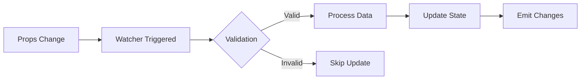
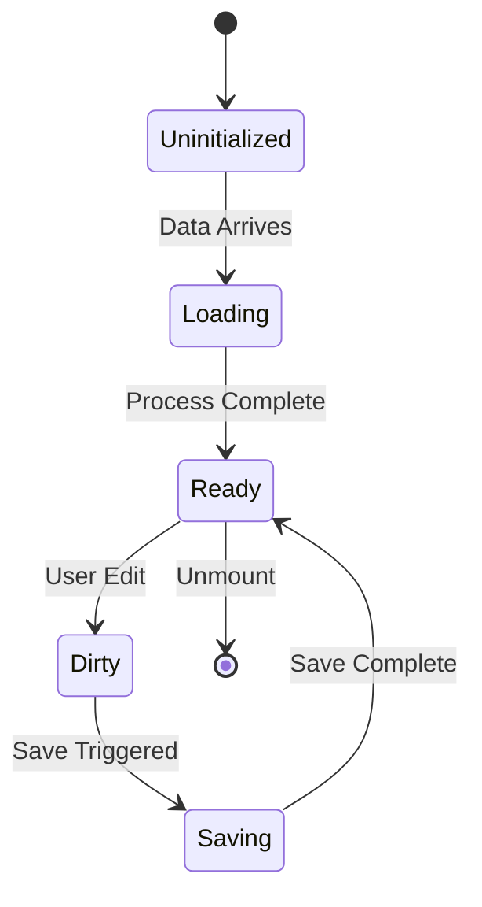
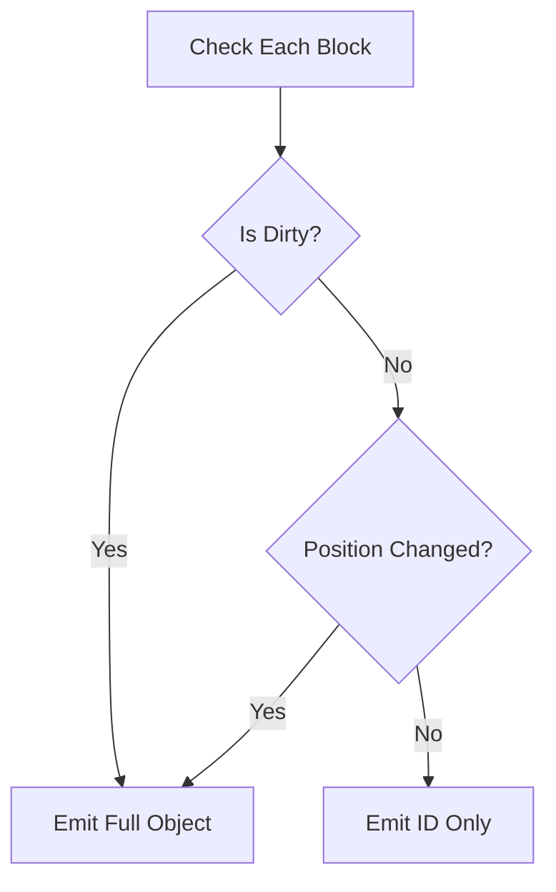

# Architecture Insights & Conclusion

## 🎯 Overview

The Expandable Blocks extension demonstrates advanced Directus interface development, solving complex state management challenges while providing an intuitive user experience. The architecture prioritizes performance, maintainability, and extensibility, making it a robust solution for M2A relationship management.

## 🔑 Key Architectural Insights

### 1. Data Flow Mastery

The extension's data flow architecture represents a sophisticated approach to handling complex state:

#### Critical Timing
- **Data loading happens in watchers, not on mount** - This prevents null reference errors
- **Props.value timing is critical** - The watcher must be immediate and deep
- **Multiple watchers coordinate state** - Each watcher has a specific responsibility

#### Implementation Pattern
```typescript
// ❌ Wrong - Data not ready
onMounted(() => {
  processData(props.value); // Often null!
});

// ✅ Correct - Wait for data
watch(() => props.value, (newValue) => {
  if (newValue) processData(newValue);
}, { immediate: true });
```

### 2. Dirty State Innovation

The extension introduces a sophisticated dirty state tracking system:

#### Dual-Layer Tracking
- **Content Changes**: Deep comparison of object data
- **Position Changes**: Tracking array order modifications
- **Combined State**: Both must be considered for accurate dirty detection

#### Key Innovation
```typescript
// Traditional: Only tracks content
const isDirty = JSON.stringify(current) !== JSON.stringify(original);

// Our approach: Tracks content AND position
const isDirty = isContentDirty || isPositionDirty;
```

### 3. Save/Discard Detection

Complex save and discard operations are detected through multiple signals:

#### Save Detection Strategy
- Monitor save button state transitions
- Detect new IDs in response data
- Track integer ID conversions (temp → permanent)
- Update original states after successful save

#### Discard Detection Pattern
- Watch for reversion to ID-only arrays
- Compare with last emitted values
- Detect Directus form reset patterns
- Preserve UI state during discard

### 4. UX Enhancements

Several architectural decisions enhance user experience:

#### State Preservation
- **Expanded blocks remain open** during discard operations
- **Scroll position maintained** during updates
- **Loading states prevent flicker** during async operations

#### Visual Feedback
- **Immediate dirty indicators** on changed blocks
- **Smooth animations** for all transitions
- **Contextual actions** based on state

## 💡 Design Principles

### 1. Native Integration First

The extension works within Directus' systems rather than around them:

```typescript
// Instead of custom API calls
await api.post('/items/blocks', data);

// We emit to Directus
emit('input', preparedData);
```

**Benefits**:
- Automatic permission handling
- Built-in validation
- Consistent error handling
- Native form integration

### 2. Performance by Design

Every architectural decision considers performance:

#### Selective Rendering
- Only render expanded blocks
- Lazy load block content
- Virtual scrolling ready

#### Efficient Updates
- Selective emitting reduces payload
- Debounced updates prevent spam
- Optimized re-render cycles

### 3. Type Safety Throughout

TypeScript strict mode ensures reliability:

```typescript
// Every function is typed
function updateBlock(
  id: string,
  data: Partial<ItemRecord>
): void

// Every state is typed
const items = ref<JunctionRecord[]>([]);

// Every emission is typed
emit<'input'>('input', value: EmitValue);
```

### 4. Extensibility Built-In

The architecture supports future enhancements:

#### Plugin Points
- Composable architecture
- Event-driven updates
- Configurable options
- Theme integration

#### Clear Boundaries
- Separation of concerns
- Modular components
- Documented interfaces
- Extensible types

## 🏗️ Architectural Patterns

### 1. Watcher-Based Architecture

Instead of imperative updates, the extension uses reactive watchers:



### 2. State Machine Pattern

Component states follow predictable transitions:



### 3. Selective Emission Pattern

Optimizes data transfer by sending only what changed:



## 🎓 Lessons Learned

### 1. Timing is Everything
- Never assume data is ready on mount
- Always use watchers for prop-dependent logic
- Handle async operations gracefully

### 2. State Management Complexity
- Simple dirty checking isn't enough for nested data
- Position changes must be tracked separately
- Original state must be immutable

### 3. User Experience Details Matter
- Preserve UI state during operations
- Provide immediate visual feedback
- Minimize cognitive load

### 4. Integration Over Isolation
- Work with the framework, not against it
- Leverage existing systems
- Maintain compatibility

## 🚀 Future Considerations

The architecture is designed to support:

1. **AI Integration** - Pluggable AI services
2. **Real-time Collaboration** - WebSocket support ready
3. **Advanced Layouts** - Flexible rendering system
4. **Performance Scaling** - Virtual scrolling foundation

## 📚 Technical Debt & Trade-offs

### Current Limitations
1. **Bundle Size** - Full Vue 3 included
2. **Browser Support** - Modern browsers only
3. **Complexity** - Advanced TypeScript knowledge required

### Accepted Trade-offs
1. **Complexity for Flexibility** - More code for better UX
2. **Performance for Features** - Some overhead for rich functionality
3. **Type Safety for Development Speed** - Stricter types slow initial development

## 🎯 Success Metrics

The architecture successfully achieves:

- ✅ **Seamless Directus Integration**
- ✅ **Intuitive User Experience**
- ✅ **Robust Dirty State Tracking**
- ✅ **Performant Operations**
- ✅ **Type-Safe Implementation**
- ✅ **Extensible Design**

## 🙏 Acknowledgments

This extension builds upon:
- Directus' excellent extension system
- Vue 3's Composition API
- TypeScript's type system
- The open-source community

## 📖 Final Thoughts

The Expandable Blocks extension represents a sophisticated solution to a complex problem. By understanding and respecting Directus' architecture while innovating where needed, we've created a tool that enhances the content editing experience without compromising system integrity.

The detailed documentation, comprehensive type definitions, and extensive examples ensure that future developers can understand, maintain, and extend this solution effectively.

> **Remember**: Good architecture is not about perfection, but about making the right trade-offs for your specific use case.

---

**Thank you for exploring the Expandable Blocks architecture!**

For questions, contributions, or discussions, please visit our [GitHub repository](https://github.com/smartlabsAT/directus-expandable-blocks).